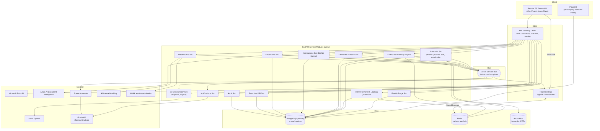
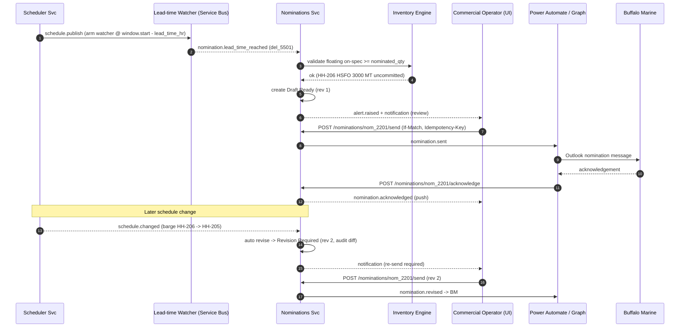

# Harbormaster — API Architecture

**Platform:** Harbormaster — Houston Harbor Bunker Fleet, Inventory & Commercial Operations Platform
**Audience:** Backend/API engineers, integration engineers, frontend leads, platform/SRE.
**Companion:** Read `_DOMAIN_MODEL.md` first — this document is fully consistent with its barge IDs (`HH-201`..`HH-208`), product codes (`VLSFO`/`HSFO`/`ULSFO`/`LSMGO`/`MGO`), the 16-state operational status lifecycle, the Buffalo Marine nomination states, the eight roles, and the enterprise inventory dimensions.

---

## 1. Architecture Overview

Harbormaster is an event-driven, service-oriented backend fronting a real-time React terminal UI. A single API gateway terminates auth (Entra ID / OIDC) and fans requests out to a set of cohesive FastAPI service modules that share a PostgreSQL primary (with read replicas) and a Redis layer used for both caching and pub/sub. Every meaningful domain mutation emits a versioned event onto **Azure Service Bus**; those events drive (a) the real-time push layer (SignalR/WebSocket) that keeps every dispatcher screen live, (b) Power Automate flows for Teams/Outlook side-effects, and (c) asynchronous AI workloads (dispatch optimization, copilot actions, inspection OCR).

The design goals, in priority order:

1. **Operational truth is single-sourced.** Schedule state, inventory ledger, and delivery status live in PostgreSQL with optimistic concurrency; no screen mutates without an ETag round-trip.
2. **Everything interesting is an event.** `schedule.changed`, `inventory.updated`, `nomination.sent`, `inspection.received`, `alert.raised` are the backbone of both UX and automation.
3. **AI is a service, not a coupling.** Copilot and dispatch optimization consume the same public REST contracts a human would, so their actions are auditable and reversible.
4. **24/7/365 resilience.** Multi-AZ active-active API, replicated data, graceful degradation of external integrations (AIS/NOAA/OpenAI) behind circuit breakers.

### 1.1 Container Diagram (C4-ish)



---

## 2. API Design Principles

- **REST + resource-oriented.** Nouns are resources (`/barges`, `/schedule-events`, `/deliveries`, `/nominations`), verbs are HTTP methods. Non-CRUD transitions are modeled as sub-resources or action endpoints (`POST /deliveries/{id}/transitions`, `POST /schedule/publish`).
- **Versioning.** All routes are prefixed `/api/v1`. Breaking changes bump to `/api/v2`; additive changes stay in `v1`. The negotiated version is echoed in the `Harbormaster-Api-Version` response header.
- **Pagination.** List endpoints are cursor-paginated: `?limit=50&cursor=<opaque>`. Responses carry a stable envelope:
  ```json
  { "items": [ ... ], "page": { "limit": 50, "next_cursor": "eyJpZCI6...", "has_more": true } }
  ```
  Cursors encode a sort key + tiebreaker id; `limit` max 200 (default 50).
- **Idempotency keys.** All unsafe non-idempotent POSTs (nomination send, transition, publish, AI action apply) accept `Idempotency-Key: <uuid>`. The key + request hash is stored in Redis 24h; a replay returns the original response with `Idempotent-Replay: true`.
- **Optimistic concurrency (ETags).** Every mutable resource returns a strong `ETag` (row `version` int, e.g. `"v42"`). Edits **must** send `If-Match`. A stale value yields `412 Precondition Failed`. This is mandatory for all schedule edits — concurrent dispatchers cannot silently clobber each other.
- **Errors: `application/problem+json`** (RFC 9457):
  ```json
  {
    "type": "https://errors.harbormaster.io/schedule/lock-held",
    "title": "Schedule window is locked",
    "status": 409,
    "detail": "Schedule window 2026-07-24T00:00Z..2026-07-25T00:00Z is locked by user marie.dispatch.",
    "instance": "/api/v1/schedule-events/se_8842",
    "correlation_id": "01J8...ZK",
    "errors": [ { "field": "start_at", "code": "outside_lock_window" } ]
  }
  ```
- **Correlation IDs.** Gateway injects `Correlation-Id` (ULID) if absent; it flows through every service log, every Service Bus message header, and every `problem+json` body. WebSocket frames carry the originating correlation id so the UI can tie a live push back to the action that caused it.
- **Content & time.** JSON only. All timestamps ISO-8601 UTC with `Z`. Quantities in **MT** unless a field is explicitly suffixed (`_l15c` = liters @ 15°C). Money in USD minor-unit-safe decimals as strings.
- **Field conventions.** `snake_case` JSON; resource ids are prefixed ULIDs (`del_`, `se_`, `nom_`, `insp_`); barge/product/tank use their canonical domain codes verbatim.

---

## 3. Authentication & Authorization

### 3.1 Entra ID (OIDC/OAuth2) flow
- Frontend uses **Authorization Code + PKCE** against the tenant's Entra ID. Access tokens are JWTs scoped to the API app registration (`api://harbormaster`).
- Service-to-service and Power Automate use **client credentials** with dedicated app registrations and app-role assignments.
- Tokens: `aud=api://harbormaster`, `iss=https://login.microsoftonline.com/<tenant>/v2.0`, 60-min lifetime, refresh via silent renewal.

### 3.2 JWT validation (gateway + per-service)
Validated on every request: signature against JWKS (cached, key-rotation aware), `iss`, `aud`, `exp`/`nbf`, and `tid` (tenant). The gateway rejects invalid tokens with `401` before routing. Services re-validate (defense in depth) and additionally enforce role/scope.

### 3.3 App roles → RBAC scopes
Entra **app roles** map to the eight domain roles and are carried in the `roles` claim. Roles resolve to coarse scopes checked by decorators/dependencies:

| Domain role (Entra app role) | Primary scopes |
|---|---|
| Commercial Operator | `deliveries:write`, `nominations:write`, `inventory:read` |
| Dispatcher | `schedule:write`, `fleet:read`, `terminal:write`, `deliveries:write` |
| Marine Scheduler | `schedule:write`, `schedule:publish`, `fleet:read` |
| Blender | `inventory:write`, `terminal:read` |
| Trader | `inventory:read`, `deliveries:read`, `kpi:read` |
| Commercial Manager | `nominations:approve`, `deliveries:write`, `kpi:read` |
| Operations Manager | `schedule:publish`, `terminal:write`, `fleet:write`, `audit:read` |
| Executive Leadership | `kpi:read`, `audit:read` (read-only across domains) |

Endpoint reference below lists **required role(s)**; the gateway maps role→scope, services assert scope. Elevated actions (publish, nomination approve/send, transition to `Delivery Complete`) require a role that holds the specific write scope, never merely read.

### 3.4 Row-level security (RLS)
PostgreSQL RLS policies key off a session GUC set per request (`SET app.user_id`, `app.roles`, `app.tenant`):
- **Tenant isolation** — every operational table carries `tenant_id`; RLS forbids cross-tenant reads.
- **Assignment scoping** — Dispatchers see all barges but may only mutate schedule events for barges not off-hired; Blenders may only write inventory adjustments for tanks/products in their assigned terminal.
- **Executive read-only** — the Executive Leadership role is bound to a `SELECT`-only Postgres role; no policy grants it `INSERT/UPDATE`.
- Audit rows are append-only (RLS blocks `UPDATE`/`DELETE` for all roles including Operations Manager).

---

## 4. REST Endpoint Reference

Base path for all endpoints: `/api/v1`. Auth required unless noted. Standard headers (`Correlation-Id`, `If-Match`, `Idempotency-Key`) apply as described in §2.

### 4.1 Fleet & Barges

**`GET /barges`** — List the 8 chartered barges with live status.
Query: `?status=Loading&product=VLSFO&available=true`
Roles: any authenticated.
```json
{ "items": [ {
  "barge_id": "HH-205", "name": "Texas City", "capacity_mt": 8000,
  "status": "Waiting to Load", "current_product": "VLSFO",
  "onboard_mt": 120.0, "heel_mt": 85.0, "utilization_pct": 74.2,
  "idle_hours_7d": 11.5, "charter_cost_per_day_usd": "9800.00",
  "position": { "lat": 29.72, "lon": -94.98, "sog_kn": 0.1, "source": "AIS" },
  "off_hire": null, "version": 42
} ], "page": { "limit": 50, "next_cursor": null, "has_more": false } }
```

**`GET /barges/{barge_id}`** — Single barge detail (charter contract, heel, off-hire windows, utilization history). Returns `ETag`.

**`PATCH /barges/{barge_id}`** — Update charter/off-hire metadata. Requires `If-Match`. Roles: Operations Manager.
```json
{ "off_hire": { "start_at": "2026-08-01T00:00:00Z", "end_at": "2026-08-03T00:00:00Z", "reason": "drydock survey" } }
```

**`GET /barges/{barge_id}/utilization`** — Time-series utilization/idle-hours. Query: `?from=&to=&bucket=day`. Roles: any authenticated.

### 4.2 Scheduler (schedule events, publish, lock, undo/redo)

The schedule is a set of **schedule events** (a barge assignment/movement over a time window) forming a working draft that is **published** to become operational. All edits are ETag-guarded and produce undoable revisions.

**`GET /schedule-events`** — List events in a window/board.
Query: `?from=2026-07-24T00:00Z&to=2026-07-26T00:00Z&barge_id=HH-201&state=draft`
Roles: any authenticated.
```json
{ "items": [ {
  "id": "se_8842", "barge_id": "HH-201", "delivery_id": "del_5501",
  "kind": "delivery", "start_at": "2026-07-24T14:00:00Z", "end_at": "2026-07-24T20:00:00Z",
  "state": "draft", "locked": false, "revision": 7, "version": 12
} ], "page": { "limit": 50, "next_cursor": null, "has_more": false } }
```

**`POST /schedule-events`** — Create an event (assign barge to delivery / transit / loading slot). `Idempotency-Key` recommended. Roles: Dispatcher, Marine Scheduler.
```json
{ "barge_id": "HH-203", "delivery_id": "del_5510", "kind": "delivery",
  "start_at": "2026-07-25T06:00:00Z", "end_at": "2026-07-25T11:00:00Z" }
```
Returns `201` with the created event + `ETag`. On conflict (barge double-booked / off-hire overlap) → `409` problem+json.

**`PUT /schedule-events/{id}`** — Move/resize an event. **Requires `If-Match`.** `412` on stale ETag; `409` if the target window is locked. Roles: Dispatcher, Marine Scheduler. Emits `schedule.changed`.

**`DELETE /schedule-events/{id}`** — Remove a draft event (`If-Match` required). Roles: Dispatcher, Marine Scheduler.

**`POST /schedule/validate`** — Dry-run validate the working draft (capacity, off-hire, HOFTI loading conflicts, nomination lead-time feasibility) without mutating. Roles: Dispatcher, Marine Scheduler.
```json
{ "window": { "from": "2026-07-24T00:00Z", "to": "2026-07-27T00:00Z" } }
```
```json
{ "valid": false, "issues": [
  { "severity": "error", "event_id": "se_8842", "code": "barge_offhire_overlap", "message": "HH-201 off-hire 07-24" },
  { "severity": "warning", "delivery_id": "del_5510", "code": "nomination_lead_time_at_risk", "lead_time_hr": 12 }
] }
```

**`POST /schedule/publish`** — Promote the validated draft window to operational; assigns firm barge→delivery bindings and triggers downstream automation (auto-nomination lead-time watchers). **Requires `If-Match: <board_version>`.** Roles: Marine Scheduler, Operations Manager. Emits `schedule.changed` (`reason: "published"`).
```json
{ "window": { "from": "2026-07-24T00:00Z", "to": "2026-07-27T00:00Z" }, "note": "Wed dayside publish" }
```
```json
{ "published_revision": 118, "affected_events": 23, "board_version": "v119" }
```

**`POST /schedule/lock`** — Lock a time window (freeze edits during an active load/publish). Roles: Dispatcher, Operations Manager.
```json
{ "from": "2026-07-24T00:00Z", "to": "2026-07-25T00:00Z", "reason": "active loading" }
```
**`DELETE /schedule/lock/{lock_id}`** — Release lock. Roles: Operations Manager, lock owner.

**`POST /schedule/undo`** / **`POST /schedule/redo`** — Step the board's linear revision history back/forward. Undo/redo operate on the **board revision stack** (server-authoritative): each mutating op pushes a revision; `undo` pops to `revision-1`, `redo` re-applies. Undo of a *published* revision requires Operations Manager and re-emits `schedule.changed`. Locked windows block undo that would alter locked events (`409`).
```json
{ "to_revision": 117 }
```
```json
{ "current_revision": 117, "redoable": true, "board_version": "v120" }
```

**`GET /schedule/revisions`** — Revision/audit trail of the board (who/when/what, undoable flag). Roles: any authenticated.

### 4.3 HOFTI Terminal & Loading Queue

**`GET /terminal/tanks`** — HOFTI tanks T-01..T-08 with inventory metrics. Query: `?product=VLSFO`. Roles: any authenticated.
```json
{ "items": [ {
  "tank_id": "T-03", "product": "VLSFO",
  "current_mt": 5400.0, "working_mt": 5200.0, "minimum_operating_mt": 800.0,
  "available_mt": 4400.0, "reserved_mt": 1000.0,
  "incoming_replenishment_mt": 6000.0, "eta_replenishment": "2026-07-25T09:00:00Z",
  "utilization_pct": 67.5, "projected_mt": 8800.0, "version": 90
} ] }
```

**`GET /terminal/berths`** — Berth A / Berth B state (active barge, loading rate MT/hr, ETA free). Roles: any authenticated.

**`GET /terminal/loading-queue`** — Ordered loading queue across berths. Roles: any authenticated.
```json
{ "items": [ {
  "queue_id": "lq_311", "barge_id": "HH-205", "product": "VLSFO", "requested_mt": 6000.0,
  "berth": "A", "status": "Loading", "position": 1,
  "loading_rate_mt_hr": 900.0, "started_at": "2026-07-24T12:10:00Z", "eta_complete": "2026-07-24T18:50:00Z"
} ] }
```

**`POST /terminal/loading-queue`** — Enqueue a barge for loading. Roles: Dispatcher, Operations Manager. Emits `inventory.updated` (reserved) on accept.
```json
{ "barge_id": "HH-207", "product": "LSMGO", "requested_mt": 2800.0, "berth_preference": "B" }
```

**`PATCH /terminal/loading-queue/{queue_id}`** — Reorder / reassign berth / update rate. `If-Match` required. Roles: Dispatcher, Operations Manager.

**`POST /terminal/loading-queue/{queue_id}/complete`** — Mark load complete (records loaded qty, moves barge status → `Load Complete`, decrements tank, increments floating inventory). Roles: Dispatcher, Operations Manager. Emits `inventory.updated` + `schedule.changed`.
```json
{ "loaded_mt": 5980.0, "loaded_l15c": 6510200, "temperature_c": 41.5 }
```

### 4.4 Floating Inventory (on-barge)

**`GET /floating-inventory`** — Product currently on the water, per barge. Query: `?product=HSFO&barge_id=HH-206&committed=false`. Roles: any authenticated.
```json
{ "items": [ {
  "barge_id": "HH-206", "name": "Baytown", "product": "HSFO",
  "onboard_mt": 5200.0, "heel_mt": 90.0, "deliverable_mt": 5110.0,
  "committed_mt": 3000.0, "uncommitted_mt": 2110.0,
  "committed_to": [ { "delivery_id": "del_5501", "qty_mt": 3000.0 } ],
  "loaded_at": "2026-07-24T18:50:00Z"
} ], "summary_mt": { "HSFO": 5200.0 } }
```

**`GET /floating-inventory/available`** — Convenience slice: uncommitted, on-spec, deliverable floating product (the copilot's "show available floating inventory"). Query: `?product=&customer_reachable=true`. Roles: any authenticated.

### 4.5 Enterprise Inventory Engine

The single ledger answering "how much of what, where, in which commitment state." Every quantity is expressible along the dimensions from the domain model.

**`GET /inventory`** — Query the ledger with dimensional slices.
Query params:
- `dimension` (repeatable): one or more of `physical`, `floating`, `hofti`, `reserved`, `committed`, `uncommitted`, `commercial_available`, `off_spec`, `projected`.
- `slice_by` (repeatable): `product` | `barge` | `customer` | `terminal` | `delivery_window`.
- Filters: `product=`, `barge_id=`, `customer=`, `terminal=HOFTI`, `window_start=`, `window_end=`, `as_of=` (point-in-time), `projection_horizon_hr=`.

Roles: any authenticated (`inventory:read`).
Example: `GET /inventory?dimension=commercial_available&dimension=projected&slice_by=product&projection_horizon_hr=48`
```json
{
  "as_of": "2026-07-24T20:00:00Z",
  "dimensions": ["commercial_available", "projected"],
  "slices": [
    { "product": "VLSFO", "commercial_available_mt": 9510.0, "projected_mt": 15300.0 },
    { "product": "HSFO",  "commercial_available_mt": 2110.0, "projected_mt": 2110.0 },
    { "product": "ULSFO", "commercial_available_mt": 640.0,  "projected_mt": 640.0 },
    { "product": "LSMGO", "commercial_available_mt": 1800.0, "projected_mt": 4600.0 },
    { "product": "MGO",   "commercial_available_mt": 300.0,  "projected_mt": 300.0 }
  ],
  "totals_mt": { "commercial_available": 14360.0, "projected": 22950.0 }
}
```

**`GET /inventory/positions`** — Fully-exploded position grid (product × barge × terminal × window × commitment state) for the enterprise inventory board. Cursor-paginated. Roles: `inventory:read`.

**`POST /inventory/adjustments`** — Manual ledger adjustment (heel correction, off-spec reclassification, blend). `Idempotency-Key` + `If-Match` on the affected position. Roles: Blender, Commercial Operator. Emits `inventory.updated`.
```json
{ "product": "VLSFO", "location": { "type": "barge", "id": "HH-205" },
  "delta_mt": -25.0, "reason": "off_spec_reclass", "note": "sulphur 0.53%, moved to off-spec" }
```

**`POST /inventory/reservations`** — Reserve/commit product against a delivery. Roles: Commercial Operator, Trader. Emits `inventory.updated`.
```json
{ "product": "HSFO", "qty_mt": 3000.0, "delivery_id": "del_5501", "source": { "type": "barge", "id": "HH-206" } }
```

### 4.6 Deliveries & Status Lifecycle

Deliveries follow the canonical 16-state operational lifecycle from the domain model. Transitions are guarded and audited.

**`GET /deliveries`** — Query. `?status=Bunkering&customer=Maersk&product=VLSFO&window_start=&window_end=`. Roles: any authenticated.
```json
{ "items": [ {
  "id": "del_5501", "customer": "Maersk", "vessel": "Maersk Sentosa", "product": "HSFO",
  "nominated_qty_mt": 3000.0, "delivery_window": { "start": "2026-07-24T22:00:00Z", "end": "2026-07-25T04:00:00Z" },
  "location": { "type": "anchorage", "ref": "Bolivar Roads A-3" },
  "nomination_lead_time_hr": 12, "barge_id": "HH-206", "status": "Nomination Sent",
  "nomination_id": "nom_2201", "version": 30
} ] }
```

**`GET /deliveries/{id}`** — Detail incl. status history + linked nomination/inspection. Returns `ETag`.

**`POST /deliveries`** — Create a delivery (customer nomination request intake). Roles: Commercial Operator. Initial status `Available` context (unassigned).
```json
{ "customer": "MSC", "vessel": "MSC Diana", "product": "VLSFO", "nominated_qty_mt": 1800.0,
  "delivery_window": { "start": "2026-07-26T08:00:00Z", "end": "2026-07-26T14:00:00Z" },
  "location": { "type": "berth", "ref": "Bayport 5" }, "nomination_lead_time_hr": 24 }
```

**`GET /deliveries/{id}/transitions`** — Legal next states from current status. Roles: any authenticated.
```json
{ "current": "Load Complete", "allowed": ["Inspection Pending"] }
```

**`POST /deliveries/{id}/transitions`** — Advance status along the lifecycle. **`If-Match` required.** Server enforces legal ordering (`Available → Transit to HOFTI → Waiting to Load → Loading → Load Complete → Inspection Pending → Inspection Complete → Nomination Draft Ready → Nomination Sent → Transit to Customer → Waiting Alongside → Bunkering → Delivery Complete → Return Transit → Queue for Reload → Available Again`). Illegal jumps → `422`. Roles: Dispatcher, Commercial Operator (Operations Manager for `Delivery Complete`). Emits `schedule.changed` + may emit `nomination.*`.
```json
{ "to": "Inspection Pending", "note": "load done, awaiting surveyor", "occurred_at": "2026-07-24T18:55:00Z" }
```
```json
{ "id": "del_5501", "status": "Inspection Pending", "version": 31,
  "history": [ { "status": "Load Complete", "at": "2026-07-24T18:50:00Z", "by": "auto" } ] }
```

### 4.7 Nominations (Buffalo Marine)

Nomination states from the domain model: `Draft Ready → Sent → Acknowledged → Revision Required (loop)`, with `Revised` re-issue carrying an audit trail.

**`GET /nominations`** — `?state=Sent&delivery_id=&counterparty=Buffalo%20Marine`. Roles: any authenticated.

**`POST /nominations`** — Draft a nomination for a delivery (usually system-generated at lead time; can be manual). Roles: Commercial Operator. State → `Draft Ready`.
```json
{ "delivery_id": "del_5501", "counterparty": "Buffalo Marine",
  "product": "HSFO", "qty_mt": 3000.0, "barge_id": "HH-206",
  "delivery_window": { "start": "2026-07-24T22:00:00Z", "end": "2026-07-25T04:00:00Z" },
  "vessel": "Maersk Sentosa", "terms_ref": "BM-MSA-2026" }
```
```json
{ "id": "nom_2201", "state": "Draft Ready", "revision": 1, "version": 1 }
```

**`GET /nominations/{id}`** — Detail incl. revision/audit trail. `ETag`.

**`POST /nominations/{id}/send`** — Send to Buffalo Marine (Graph/Outlook draft or API per counterparty channel). **`If-Match` + `Idempotency-Key` required.** Roles: Commercial Operator, Commercial Manager. State `Draft Ready|Revision Required → Sent`. Emits `nomination.sent`.
```json
{ "channel": "outlook", "cc": ["ops-desk@operator.com"], "message": "Nomination attached; please acknowledge." }
```

**`POST /nominations/{id}/acknowledge`** — Record Buffalo Marine acknowledgement (via webhook/Power Automate inbound or manual). State `Sent → Acknowledged`. Roles: Commercial Operator (or system). 
```json
{ "acknowledged_by": "Buffalo Marine Dispatch", "ack_ref": "BM-ACK-90781", "at": "2026-07-24T13:20:00Z" }
```

**`POST /nominations/{id}/revise`** — Open a revision (schedule change, qty/window change, or counterparty `Revision Required`). Creates a new revision, preserves prior in audit trail, state → `Revision Required` then re-`send`. **`If-Match` required.** Roles: Commercial Operator, Commercial Manager. Emits `nomination.revised`.
```json
{ "reason": "schedule_change", "changes": { "barge_id": "HH-205", "delivery_window": { "start": "2026-07-25T02:00:00Z", "end": "2026-07-25T08:00:00Z" } } }
```
```json
{ "id": "nom_2201", "state": "Revision Required", "revision": 2,
  "audit": [ { "revision": 1, "state": "Sent", "at": "2026-07-24T12:00:00Z" } ] }
```

### 4.8 Inspections (PDF → Document Intelligence)

**`POST /inspections`** — Create an inspection record for a delivery and get a Blob upload target. Roles: Commercial Operator, Dispatcher.
```json
{ "delivery_id": "del_5501", "type": "bunker_delivery_note" }
```
```json
{ "id": "insp_770", "upload_url": "https://blob.../insp_770?sas=...", "status": "awaiting_upload" }
```

**`POST /inspections/{id}/document`** — Notify that the PDF is uploaded (or multipart upload the PDF directly). Triggers async Azure AI Document Intelligence extraction. Roles: Commercial Operator, Dispatcher. On completion emits `inspection.received`.
```json
{ "blob_ref": "insp/insp_770.pdf", "content_type": "application/pdf" }
```
```json
{ "id": "insp_770", "status": "extracting" }
```

**`GET /inspections/{id}`** — Extraction result + reconciliation. Roles: any authenticated.
```json
{
  "id": "insp_770", "delivery_id": "del_5501", "status": "extracted",
  "extraction": {
    "product": "HSFO", "quantity_mt": 2998.4, "quantity_l15c": 3260050,
    "density_15c": 0.9910, "temperature_c": 42.1, "sulphur_pct": 3.42,
    "bdn_number": "BDN-778812", "surveyor": "SGS", "confidence": 0.94
  },
  "reconciliation": { "nominated_mt": 3000.0, "measured_mt": 2998.4, "variance_mt": -1.6, "variance_pct": -0.05, "within_tolerance": true },
  "review_required": false
}
```

**`POST /inspections/{id}/approve`** — Accept extraction (or corrected values) and reconcile inventory. Roles: Commercial Operator, Blender. Emits `inventory.updated`.

### 4.9 Charter Optimization

**`POST /charter/optimize`** — Optimize fleet charter utilization / barge-to-delivery assignment over a horizon (minimize idle + charter cost, maximize on-time nominations). Async job. Roles: Operations Manager, Commercial Manager.
```json
{ "horizon": { "from": "2026-07-24T00:00Z", "to": "2026-07-31T00:00Z" },
  "objective": "min_cost_max_utilization",
  "constraints": { "respect_off_hire": true, "respect_locks": true, "max_reassignments": 12 } }
```
```json
{ "job_id": "opt_4410", "status": "queued" }
```

**`GET /charter/optimize/{job_id}`** — Result: proposed reassignments + projected utilization/cost deltas. Roles: Operations Manager, Commercial Manager.
```json
{ "job_id": "opt_4410", "status": "done",
  "current": { "fleet_utilization_pct": 61.0, "weekly_charter_cost_usd": "512400.00", "idle_barge_days": 6.2 },
  "proposed": { "fleet_utilization_pct": 78.5, "weekly_charter_cost_usd": "512400.00", "idle_barge_days": 2.1 },
  "reassignments": [ { "delivery_id": "del_5510", "from_barge": "HH-201", "to_barge": "HH-203", "idle_saved_hr": 9.0 } ] }
```

**`POST /charter/optimize/{job_id}/apply`** — Apply proposal to the working schedule draft (creates undoable revision, respects locks/ETags). `Idempotency-Key` required. Roles: Marine Scheduler, Operations Manager. Emits `schedule.changed`.

### 4.10 AI Dispatch / Copilot

**`POST /ai/dispatch/optimize`** — Real-time dispatch recommendation for a single decision (which barge, when, from which tank) given current state. Roles: Dispatcher, Marine Scheduler. See §7.1 contract.

**`POST /ai/copilot`** — Natural-language intent → structured action proposal. Roles: any authenticated (action *apply* still requires the underlying endpoint's role). See §7.2.
```json
{ "utterance": "Move Delivery 14 to Barge 2", "context": { "board_window": { "from": "2026-07-24T00:00Z", "to": "2026-07-26T00:00Z" } } }
```
```json
{
  "intent": "reassign_delivery",
  "confidence": 0.96,
  "entities": { "delivery_id": "del_0014", "target_barge_id": "HH-202" },
  "proposed_action": { "method": "PUT", "path": "/api/v1/schedule-events/se_9001",
    "body": { "barge_id": "HH-202" }, "requires_role": "Dispatcher", "requires_if_match": true },
  "explanation": "Reassigns Delivery 14 from HH-201 to HH-202 (Buffalo Bayou); HH-202 has 6,500 MT capacity and is idle in the window.",
  "warnings": [] 
}
```

**`POST /ai/copilot/apply`** — Execute a previously proposed action after user confirmation. Server re-checks role, ETag, locks; wraps the underlying mutation. `Idempotency-Key` required. Roles: per proposed action.

### 4.11 Weather / AIS

**`GET /environment/ais`** — AIS positions for tracked vessels + own barges. `?bbox=&vessel=`. Roles: any authenticated. (Backed by AIS integration, Redis-cached ~30s.)
```json
{ "items": [ { "mmsi": 366998110, "name": "Maersk Sentosa", "lat": 29.35, "lon": -94.71, "sog_kn": 0.0, "nav_status": "at anchor", "updated_at": "2026-07-24T19:59:40Z" } ] }
```

**`GET /environment/weather`** — NOAA marine conditions/forecast for Houston Ship Channel zones. `?zone=GMZ335`. Roles: any authenticated.

**`GET /environment/advisories`** — Active NOAA marine advisories/warnings; feeds `alert.raised`. Roles: any authenticated.

### 4.12 Executive KPIs

**`GET /kpi/executive`** — Executive summary tiles (fleet utilization, on-time nomination %, delivered MT, charter cost efficiency, inventory turns, off-spec rate). `?from=&to=`. Roles: Executive Leadership, Commercial Manager, Operations Manager, Trader.
```json
{ "period": { "from": "2026-07-01", "to": "2026-07-24" },
  "fleet_utilization_pct": 74.2, "on_time_nomination_pct": 96.1,
  "delivered_mt": 184200.0, "charter_cost_usd": "1841000.00", "cost_per_mt_usd": "9.99",
  "inventory_turns": 3.4, "off_spec_rate_pct": 0.6 }
```

**`GET /kpi/timeseries`** — Metric time-series for charts. `?metric=fleet_utilization&bucket=day&from=&to=`. Roles: as above. (Power BI reads the underlying semantic model via DirectQuery against replicas; this endpoint serves the in-app UI.)

### 4.13 Notifications

**`GET /notifications`** — Current user's notifications. `?unread=true`. Roles: any authenticated.

**`POST /notifications/{id}/read`** — Mark read. Roles: owner.

**`GET /notifications/preferences`** / **`PUT /notifications/preferences`** — Channel prefs (in-app / Teams / Outlook) per event type. Roles: owner.

### 4.14 Audit

**`GET /audit`** — Append-only audit trail. `?entity_type=nomination&entity_id=nom_2201&actor=&from=&to=`. Roles: Operations Manager, Executive Leadership, Commercial Manager.
```json
{ "items": [ {
  "id": "aud_88120", "at": "2026-07-24T12:00:03Z", "actor": "marie.dispatch",
  "action": "nomination.sent", "entity_type": "nomination", "entity_id": "nom_2201",
  "correlation_id": "01J8...ZK", "before": { "state": "Draft Ready" }, "after": { "state": "Sent" }
} ] }
```

---

## 5. Real-Time Layer

### 5.1 Transport
A dedicated **SignalR / WebSocket hub** at `wss://api.harbormaster.io/ws` (Azure SignalR Service in production). The client obtains a short-lived hub access token from `POST /api/v1/realtime/negotiate` (returns hub URL + JWT). The hub authenticates with the same Entra JWT; group membership is derived from the user's roles and subscriptions (RLS-equivalent filtering applies to pushed payloads).

### 5.2 Channels (SignalR groups) and event topics
Domain services publish to Azure Service Bus topics; a bridge subscription fans messages into SignalR groups. Frontend subscribes by joining groups:

| Channel (group) | Backing topic(s) | Payload summary |
|---|---|---|
| `schedule` | `schedule.changed` | `{ event_id, barge_id, delivery_id, reason, board_version }` |
| `inventory` | `inventory.updated` | `{ location, product, dimension, delta_mt, version }` |
| `nominations` | `nomination.sent`, `nomination.revised`, `nomination.acknowledged` | `{ nomination_id, delivery_id, state, revision }` |
| `inspections` | `inspection.received` | `{ inspection_id, delivery_id, status, review_required }` |
| `alerts` | `alert.raised` | `{ alert_id, severity, source, message, entity_ref }` |
| `barge:{barge_id}` | AIS-derived + schedule | live position + status for one barge board card |

Example frame delivered to the `schedule` group:
```json
{ "topic": "schedule.changed", "correlation_id": "01J8...ZK",
  "occurred_at": "2026-07-24T12:34:56Z",
  "data": { "event_id": "se_8842", "barge_id": "HH-201", "delivery_id": "del_5501", "reason": "moved", "board_version": "v119" } }
```

### 5.3 Frontend subscription pattern
1. `POST /realtime/negotiate` → hub URL + token.
2. Connect; `hub.invoke("Subscribe", ["schedule","inventory","alerts","barge:HH-205"])`.
3. On each frame, the store reconciles by `version`/`board_version` and, if stale, re-fetches the affected resource (ETag-aware) — the push is a *hint to re-sync*, not the source of truth. This keeps optimistic-concurrency guarantees intact even under rapid multi-user edits.
4. Reconnect uses last-seen `board_version` to request a delta via `GET /schedule/revisions?since=`.

---

## 6. Event-Driven Automation

### 6.1 Delivery approaching nomination lead time
Each published delivery has a contract `nomination_lead_time_hr` (6/12/24/48). A scheduled watcher (Service Bus scheduled message set at publish time, re-armed on schedule changes) fires when `now >= delivery_window.start - lead_time_hr`:

1. Watcher emits `nomination.lead_time_reached` for `del_5501`.
2. Nominations Svc validates feasibility (assigned barge on-spec floating inventory covers `nominated_qty_mt`, barge not off-hire, ETA fits window). On pass it creates a **Draft Ready** nomination and moves the delivery toward `Nomination Draft Ready`.
3. `alert.raised` (info) + a Notifications task ping the assigned Commercial Operator via in-app + Teams (Graph API) for review.
4. On operator **send**, `POST /nominations/{id}/send` emits `nomination.sent`; Power Automate composes/sends the Outlook message to Buffalo Marine and logs to audit.
5. Buffalo Marine acknowledgement (inbound Power Automate → `POST /nominations/{id}/acknowledge`) transitions to `Acknowledged` and pushes to the `nominations` channel.
6. If a **schedule change** later alters barge/qty/window, `schedule.changed` triggers auto-`revise`: a new nomination revision (state `Revision Required`) is drafted with a diff, the operator re-sends, and the full loop is preserved in the audit trail.

### 6.2 Inspection PDF arrives
1. PDF lands in Blob (operator upload or Power Automate from an Outlook attachment) → `POST /inspections/{id}/document`.
2. Inspections Svc calls **Azure AI Document Intelligence** (bunker delivery note model) asynchronously; status `extracting`.
3. On extraction it reconciles measured vs nominated qty (MT + l@15°C). Within tolerance → auto-`inspection.received` (status `extracted`, `review_required:false`). Out of tolerance or low confidence → `review_required:true` + `alert.raised` (warning) to Commercial Operator/Blender.
4. On approval, `inventory.updated` reconciles floating/physical ledger and the delivery may advance to `Inspection Complete`.

### 6.3 Auto-nomination sequence



---

## 7. AI Service Contracts

### 7.1 Dispatch optimization
**`POST /api/v1/ai/dispatch/optimize`**
```json
{
  "decision": "assign_barge",
  "delivery_id": "del_5510",
  "constraints": { "respect_off_hire": true, "respect_locks": true, "product": "LSMGO", "qty_mt": 2800.0 },
  "weights": { "on_time": 0.6, "cost": 0.25, "utilization": 0.15 }
}
```
Response (Azure OpenAI reasoning grounded on live fleet/inventory/terminal state; the model proposes, the ledger validates):
```json
{
  "recommendation": { "barge_id": "HH-207", "load_from_tank": "T-06",
    "loading_berth": "B", "eta_alongside": "2026-07-26T09:40:00Z" },
  "alternatives": [
    { "barge_id": "HH-208", "score": 0.81, "why": "similar ETA, higher idle cost" }
  ],
  "score": 0.91,
  "rationale": "HH-207 (Galveston, 3,000 MT) is idle and reachable within the 24h lead time; T-06 has 2,900 MT LSMGO available.",
  "constraints_satisfied": true
}
```

### 7.2 Copilot NL intent → action mapping
The copilot resolves an utterance to one of a fixed intent catalog, extracts domain entities (barges by `HH-2xx` or friendly name, products, delivery ids, customers), and returns a **proposed action** bound to a real REST call. Nothing mutates until `POST /ai/copilot/apply` with user confirmation; the underlying endpoint's role + ETag are enforced.

| Example utterance | Intent | Entities | Proposed action |
|---|---|---|---|
| "Move Delivery 14 to Barge 2" | `reassign_delivery` | `del_0014`, `HH-202` | `PUT /schedule-events/{id}` `{barge_id:"HH-202"}` |
| "Show available floating inventory" | `query_floating_available` | — | `GET /floating-inventory/available` |
| "How much VLSFO is commercially available in the next 48 hours?" | `query_inventory` | `VLSFO`, `48h`, `commercial_available` | `GET /inventory?dimension=commercial_available&slice_by=product&product=VLSFO&projection_horizon_hr=48` |
| "Draft the nomination for the Maersk Sentosa bunkering" | `draft_nomination` | `del_5501` | `POST /nominations` |
| "Lock the schedule for tonight" | `lock_schedule` | tonight window | `POST /schedule/lock` |
| "What's the loading queue at HOFTI?" | `query_loading_queue` | HOFTI | `GET /terminal/loading-queue` |
| "Which barges are idle tomorrow?" | `query_fleet` | idle, +1d | `GET /barges?available=true` (filtered) |
| "Send the Buffalo Marine nomination for Delivery 5501" | `send_nomination` | `nom_2201` | `POST /nominations/nom_2201/send` |
| "Undo the last schedule change" | `schedule_undo` | — | `POST /schedule/undo` |

Read intents may auto-execute (safe); write intents always require explicit confirmation and surface the human-readable `explanation` + `warnings` before apply.

---

## 8. Non-Functional Requirements

### 8.1 Rate limiting
- Gateway enforces per-principal token-bucket limits: **600 req/min** interactive users, **60 req/min** on expensive endpoints (`/inventory/positions`, `/charter/optimize`, `/ai/*`), **6000 req/min** for service principals (Power Automate/Power BI).
- Responses carry `RateLimit-Limit`, `RateLimit-Remaining`, `RateLimit-Reset`; `429` returns `problem+json` with `Retry-After`.
- AI endpoints additionally guard Azure OpenAI TPM quota with a Redis concurrency semaphore and shed to a queued `202` when saturated.

### 8.2 Caching
- **Redis** caches hot reads: barge list (~5s TTL), terminal tanks/berths (~5s), AIS positions (~30s), NOAA (~5min), inventory dimensional rollups (short TTL, invalidated on `inventory.updated`).
- HTTP `ETag`/`Cache-Control: private, max-age=5` on stable reads; conditional `GET` via `If-None-Match` → `304`.
- Inventory rollups use event-driven cache invalidation keyed by dimension+slice so a single `inventory.updated` evicts only affected keys.

### 8.3 HA / multi-AZ
- Active-active FastAPI across ≥3 availability zones behind the gateway; stateless services (session/state in Redis + Postgres).
- PostgreSQL: zone-redundant primary with synchronous standby + async read replicas (used by KPI/Power BI DirectQuery and heavy inventory reads).
- Redis: zone-redundant with replicas; Service Bus is a zone-redundant premium namespace.
- External integrations (AIS/NOAA/OpenAI/Graph) sit behind **circuit breakers** with cached-last-known fallback; the UI degrades gracefully (stale AIS badge, "advisories unavailable" state) rather than failing the board.
- Idempotency keys + ETags make client retries safe during failover.

### 8.4 Observability
- **App Insights** distributed tracing; the `Correlation-Id` is the trace id across gateway → services → Service Bus → SignalR.
- Structured JSON logs (actor, role, correlation id, entity refs; PII-safe). Append-only audit stream (§4.14) is the domain-level record of truth for compliance.
- Metrics: request latency/error rate per endpoint, event-bus lag, watcher-fire punctuality, AI latency/token spend, extraction confidence distribution, per-barge utilization. Alerting on SLO burn.

### 8.5 SLAs / SLOs
- API availability **99.9%** monthly; real-time hub **99.5%**.
- Read latency P95 **< 250 ms**; write P95 **< 500 ms** (excluding async AI/optimization jobs).
- Real-time push end-to-end (mutation → subscriber frame) P95 **< 2 s**.
- Auto-nomination watcher fires within **±60 s** of the computed lead-time boundary.
- Inspection extraction returns within **< 90 s** P95 for standard single-page BDNs.
- RPO **≤ 5 min** (replication), RTO **≤ 30 min** (zone failover).
```
