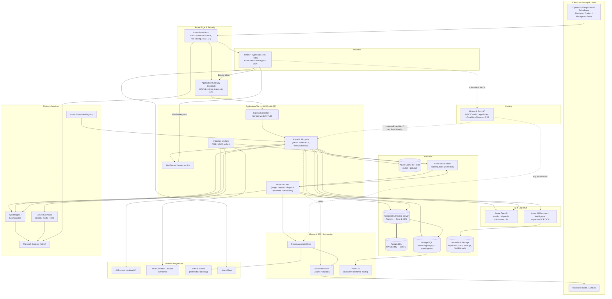

# Harbormaster — Reference Architecture

**Platform:** Harbormaster — Houston Harbor Bunker Fleet, Inventory & Commercial Operations Platform
**Operator tenant:** Fortune 100 energy major · **Counterparty:** Buffalo Marine · **Terminal:** HOFTI
**Ops tempo:** 24/7/365, Houston Ship Channel
**Document owner:** Principal Security & Platform Architect
**Version:** 1.0 · **Last reviewed:** 2026-07-24

Companion documents: `_DOMAIN_MODEL.md` (canonical domain), `SECURITY_MODEL.md` (identity/RBAC/data protection), `POWERBI_REPORTING.md` (analytics semantic model). Terminology (barges HH-201…HH-208, HOFTI tanks, products, roles, nomination states) is consistent with the domain model.

---

## 1. Architecture Overview

Harbormaster is a cloud-native, event-driven platform on Microsoft Azure. A React/TypeScript SPA drives a FastAPI backend running on AKS, backed by PostgreSQL Flexible Server (HA + read replicas), Redis, and Azure Service Bus. AI services (Azure OpenAI, Document Intelligence), Microsoft 365 (Graph/Teams/Outlook, Power Automate), Power BI, Azure Maps, and marine data feeds (AIS, NOAA) are integrated at the edges. Everything is fronted by Azure Front Door + WAF and secured per `SECURITY_MODEL.md`.

Design tenets:
- **Event-driven core** — barge status transitions, ledger movements, terminal events, and AIS/NOAA updates flow as events on Service Bus; the read model is projected to Postgres and pushed to clients over WebSocket.
- **Stateless API, stateful data tier** — FastAPI pods are stateless and horizontally scaled; state lives in Postgres/Redis/Service Bus.
- **Active-active, multi-AZ** — no single-AZ dependency in the hot path.
- **IaC everything** — no click-ops in staging/prod.

---

## 2. Reference Deployment / Container Diagram

### 2.1 Component responsibilities
| Component | Responsibility |
|---|---|
| **Azure Front Door + WAF** | Global entry, TLS termination (1.2+/1.3), OWASP WAF, rate limiting, geo/bot rules, CDN for SPA static assets |
| **Application Gateway (WAF v2)** | Regional private ingress to AKS, path routing, second WAF layer |
| **Static Web Apps / CDN** | Hosts the React/TS SPA (Vite build), cached at edge |
| **FastAPI on AKS** | REST API, RBAC/RLS/FLS enforcement, WebSocket hub, orchestration |
| **Async workers (AKS)** | Ledger projection, AI dispatch optimization, notification dispatch, Power Automate triggers |
| **Ingestion workers (AKS)** | Poll AIS + NOAA, normalize, publish events to Service Bus |
| **PostgreSQL Flexible Server** | System of record: fleet, HOFTI tanks, inventory ledger, nominations, audit; HA primary + standby, read replicas |
| **Redis** | Hot cache (schedule board, tank state, KPI tiles) + pub/sub for WebSocket fan-out |
| **Service Bus** | Durable event bus for status transitions and integration events |
| **Blob Storage** | Inspection PDFs, DB backups, WORM audit archive |
| **Azure OpenAI** | Copilot (NL query), dispatch optimization recommendations, drafting assistance |
| **Document Intelligence** | OCR/extraction of inspection PDFs into structured records |
| **Power Automate + Graph** | Teams/Outlook notifications, nomination email delivery to Buffalo Marine |
| **Power BI** | Executive semantic model / dashboards (see `POWERBI_REPORTING.md`) |
| **Azure Maps** | Vessel/barge positions, terminal geospatial views |
| **Key Vault / App Insights / Sentinel / ACR** | Secrets, observability, SIEM, image registry |

---

## 3. High Availability & Disaster Recovery

### 3.1 Availability topology
- **Multi-AZ within primary region** (e.g., South Central US): AKS node pools spread across 3 availability zones; FastAPI and workers run ≥ 2 replicas per zone with pod anti-affinity.
- **PostgreSQL Flexible Server** in **Zone-redundant HA** — synchronous standby in a second AZ, automatic failover; plus asynchronous **read replicas** for reporting/read-heavy paths and Power BI DirectQuery isolation.
- **Redis** in zone-redundant Premium tier; **Service Bus** Premium (zone-redundant); **Storage** ZRS/GZRS.
- **Front Door** provides global anycast entry and health-probe-based routing.

### 3.2 Active-active
- The API tier is **active-active across AZs** in the primary region behind Application Gateway/Front Door. For regional resilience, a warm **secondary region** runs a scaled-down AKS + Static Web Apps replica; Front Door health probes fail traffic over to the secondary if the primary region degrades.
- Cross-region data: PostgreSQL geo-redundant backup + read replica in the secondary region promoted on regional failover; Service Bus geo-DR alias; Key Vault replicated (geo-redundant, CMK).
- Writes are single-region-primary (Postgres primary) to preserve ledger consistency; the secondary region is read-active and promoted for writes only on regional failover.

### 3.3 RTO / RPO targets
| Scenario | RTO | RPO |
|---|---|---|
| Single pod / node failure | < 30 s (auto reschedule) | 0 |
| AZ failure (in-region) | < 2 min (HA standby promote, pods reschedule) | 0 (sync standby) |
| PostgreSQL primary failure | < 2 min (zone-redundant auto-failover) | 0 |
| Regional failure (full DR) | ≤ 30 min (RTO) | ≤ 5 min (RPO) |
| Accidental data corruption | ≤ 1 h (point-in-time restore) | ≤ 5 min |

### 3.4 Backup
- PostgreSQL: automated backups with **35-day** retention, **point-in-time restore (PITR)**, geo-redundant backup storage. Weekly restore drills validated.
- Blob (inspection PDFs, WORM audit): GZRS, soft-delete + versioning + legal hold on the audit container.
- Key Vault: soft-delete + purge protection; keys backed up to HSM-backed store.
- Config/IaC: source-controlled (Git), reproducible from Bicep/Terraform.

### 3.5 Failover, load & scale strategy
- **Horizontal Pod Autoscaler (HPA)** on API/workers by CPU + custom metrics (request latency, Service Bus queue depth, active WebSocket connections). **KEDA** scales ingestion/dispatch workers off Service Bus queue length.
- **Cluster Autoscaler** grows/shrinks AKS node pools; separate node pools for API (general), workers (compute), and system.
- Front Door + AGW distribute load and shed via WAF rate rules under attack/spike.
- Postgres read replicas absorb reporting and read-mostly board queries; Redis absorbs hot reads.

### 3.6 Health checks & resiliency patterns
- Kubernetes **liveness/readiness/startup** probes on every pod; readiness gates traffic during warmup and dependency loss.
- Front Door and AGW health probes at `/healthz` (liveness) and `/readyz` (dependency check: DB, Redis, Service Bus).
- Resiliency: retries with exponential backoff + jitter, circuit breakers on downstream (Graph, OpenAI, AIS, NOAA), timeouts, bulkheads, idempotency keys on all mutating/integration operations, and dead-letter queues on Service Bus for poison messages.

---

## 4. Environments & CI/CD

### 4.1 Environments
| Env | Purpose | Data | Scale |
|---|---|---|---|
| **dev** | Developer integration | Synthetic | Minimal, single-AZ |
| **test** | Automated/QA + integration tests | Synthetic/masked | Minimal |
| **staging** | Pre-prod, prod-like, UAT, perf/DR drills | Masked prod-shaped | Prod-like (scaled) |
| **prod** | Live 24/7 operations | Real | Full multi-AZ HA/DR |

Each environment is an isolated Azure subscription/resource group with its own Key Vault, database, and network — no shared secrets or data across environments (per `SECURITY_MODEL.md` §6.5).

### 4.2 Infrastructure as Code
- **Bicep** (primary) for Azure-native resources; **Terraform** acceptable for cross-cloud/DNS/M365 governance modules. All infra is declarative, peer-reviewed, and applied via pipeline `what-if`/`plan` gates — no manual portal changes in staging/prod.
- Modules: networking (VNet, private endpoints, NSGs, firewall), AKS, Postgres, Redis, Service Bus, Front Door/AGW/WAF, Key Vault, observability, identity/role assignments.
- IaC is scanned (checkov/tfsec) and policy-enforced (Azure Policy) before apply.

### 4.3 Pipeline (GitHub Actions, OIDC to Azure)
1. **CI:** lint (ruff/eslint), type-check (mypy/tsc), unit + integration tests, build SPA + container images, SBOM, dependency scan (Dependabot/`pip-audit`/`npm audit`), container scan (Trivy/Defender), secret scan (gitleaks), image sign (cosign).
2. **CD:** push to ACR → deploy via Bicep + Helm/Kustomize. Promotion dev → test → staging → prod, each gated by tests and approvals. Prod deploy requires review + change record (SOC2/ISO evidence).
3. **Admission control:** AKS admits only signed images from ACR (Kyverno/Gatekeeper).

### 4.4 Release strategy
- **Blue-green** deployments for the API/SPA: new (green) version deployed alongside current (blue), health-checked and smoke-tested, then Front Door/AGW/service switches traffic; instant rollback by reverting the switch.
- Database changes are **expand/contract** (backward-compatible migrations, applied before code that needs them; destructive changes deferred until old code is drained) so blue-green never breaks the schema.
- **Feature flags** (e.g., LaunchDarkly / Azure App Configuration) gate risky features (new AI dispatch model, new blend engine) for progressive rollout and kill-switch; flags are role- and environment-aware.
- Canary option: route a small % of traffic (e.g., dispatchers-only) to green before full cut-over.

---

## 5. Performance

### 5.1 Targets (p95, in-region)
| Interaction | Target |
|---|---|
| API read (board/tank/ledger slice) | < 200 ms |
| API mutation (schedule edit, ledger post) | < 400 ms |
| WebSocket event fan-out (status change → client) | < 1 s |
| SPA initial load (cached) | < 2 s |
| Schedule board render / re-render | 60 fps interaction; < 100 ms local update |
| AI dispatch recommendation | < 3 s (async, streamed) |
| Power BI DirectQuery tile | < 5 s (import tiles instant) |

### 5.2 High-performance rendering (SPA)
- The Fleet Scheduler board (8 barges × time × berths) uses **virtualized** rendering (windowed lists/canvas), `requestAnimationFrame`-batched updates, memoized selectors, and optimistic UI with server reconciliation.
- Heavy geospatial (Azure Maps vessel/barge layers) uses vector tiles and clustered markers; AIS position updates are throttled/coalesced client-side.
- Local-first state: incoming WebSocket deltas patch a normalized client store rather than refetching, keeping the board at interactive frame rates during live ops.

### 5.3 Caching layers
| Layer | Cache | TTL / invalidation |
|---|---|---|
| Edge | Front Door CDN (SPA static assets) | Immutable hashed assets, long TTL |
| API | Redis (schedule snapshot, tank state, KPI tiles, reference data) | Short TTL + event-driven invalidation on ledger/status change |
| DB read | Postgres read replicas | Async replica lag budget ≤ few seconds |
| Client | Normalized store + HTTP cache headers | Delta-patched via WebSocket |

### 5.4 WebSocket fan-out
- Clients subscribe to topics (per barge, per terminal berth, per commercial book) over a WebSocket hub. Backend publishes deltas to **Redis pub/sub**; the WS fan-out service (scaled by active connections via KEDA) pushes to subscribed clients.
- Backpressure and per-connection rate limiting protect the hub; reconnect uses a resume token to replay missed deltas from a short Redis stream buffer.

---

## 6. Integration Architecture

### 6.1 AIS vessel tracking
- Ingestion worker polls/streams the AIS provider (allow-listed egress), normalizes vessel/barge positions & voyage data, publishes `ais.position` events to Service Bus. Positions are cached in Redis and pushed to map/board over WebSocket. Rate-limited and deduplicated; failures circuit-break and degrade gracefully (last-known-position with staleness indicator).

### 6.2 NOAA weather / marine advisories
- Scheduled poller pulls NOAA marine forecasts, tide, and advisories for the Houston Ship Channel; publishes `noaa.advisory` events. The copilot and dispatch optimizer consume weather to flag risk on delivery windows; advisories surface as board overlays and Teams alerts.

### 6.3 Buffalo Marine nomination delivery
- On approved nomination (`Nomination Sent` transition, gated by SoD in `SECURITY_MODEL.md` §9.2), a worker publishes a `nomination.send` event → **Power Automate** flow composes the nomination package (PDF + structured payload) and sends via **Graph app permission** from the dedicated `nominations@` mailbox to Buffalo Marine.
- Delivery is idempotent (dedup key = nomination id + revision), retried with backoff, and the sent copy + delivery receipt are stored and audited. Acknowledgement/Revision-Required responses are captured back into the nomination lifecycle (`Acknowledged` / `Revision Required → Revised`).

### 6.4 Teams / Outlook (Graph)
- User-context notifications (draft an Outlook nomination message, post a Teams alert on a delivery slip, tank low-level, or weather advisory) use **On-Behalf-Of** delegated Graph calls (`Mail.ReadWrite`/`Mail.Send`, `ChatMessage.Send`). Broadcast/system notifications use app-permission via Power Automate.

### 6.5 Power BI
- Executive semantic model connects to Postgres **read replicas** via the analytics service principal with **RLS mirroring app roles**. Hybrid model: import for dimensions/aggregates, DirectQuery for live operational facts, push/streaming datasets for live-ops tiles. Full detail in `POWERBI_REPORTING.md`.

### 6.6 Integration principles
- All integrations are **event-driven and asynchronous** where possible (Service Bus), **idempotent**, **retried with backoff + DLQ**, **circuit-broken**, and **egress allow-listed** (SSRF control, `SECURITY_MODEL.md` §8.4). External failures never block core ops; they degrade with clear staleness/health indicators.

---

## 7. Front-End Experience & Design Strategy

### 7.1 Responsive design (desktop + tablet)
- The UI targets **operations desktops** (large multi-monitor, primary) and **tablets** (deck/terminal walk-arounds). Layout uses a responsive 12-column grid with breakpoints for desktop (≥ 1280px, dense multi-panel), and tablet (768–1279px, stacked/collapsible panels). Touch targets sized for gloved tablet use on berth/terminal views.
- The Fleet Scheduler board reflows: full multi-barge timeline on desktop; focused/scrollable per-barge lanes on tablet.

### 7.2 Keyboard-first
- Full keyboard operability for high-tempo dispatch: command palette (quick-jump to barge/tank/nomination), arrow-key navigation of the schedule grid, keyboard shortcuts for edit/publish/lock, accept-dispatch, and draft-nomination. Focus management and visible focus rings throughout; no action requires a mouse. WCAG 2.1 AA target.

### 7.3 Dark mode
- Default **dark terminal UI** (per `_DOMAIN_MODEL.md`) tuned for 24/7 control-room use and low-light bridge/deck conditions, with a light theme option. Uses a Fluent/design-system token set; colorblind-safe status palette for the operational lifecycle states; high-contrast mode available. Theme is user-persisted and respects OS preference.

### 7.4 Real-time UX
- Live board and tiles update via WebSocket without manual refresh; optimistic edits reconcile with server truth; connection health and data staleness are always visible so operators trust what they see.

---

## 8. Observability

- **App Insights + Log Analytics** across API, workers, ingestion: distributed tracing (correlation ids end-to-end), metrics (latency, error rate, saturation, queue depth, WS connections), and structured logs (PII/secret-scrubbed).
- Dashboards + alerts on the golden signals and business SLOs (event-to-client latency, nomination delivery success, AIS/NOAA freshness, ledger projection lag, replica lag).
- Security signals and audit stream to **Microsoft Sentinel** (see `SECURITY_MODEL.md` §7.4). Synthetic health checks (Front Door probes + outside-in monitors) validate the full path 24/7.

---

## 9. Summary

Harbormaster is an event-driven, multi-AZ, active-active Azure platform: a keyboard-first, dark-mode React/TS SPA over a FastAPI/AKS core, with PostgreSQL (HA + replicas), Redis, and Service Bus at the center, and AI, Microsoft 365, Power BI, Azure Maps, AIS, and NOAA integrated at the edges. It targets RTO ≤ 30 min / RPO ≤ 5 min for regional DR, sub-second live-ops fan-out, blue-green + feature-flagged delivery from fully IaC-defined environments, and hardened, allow-listed, idempotent integrations — consistent with the security controls in `SECURITY_MODEL.md`.
