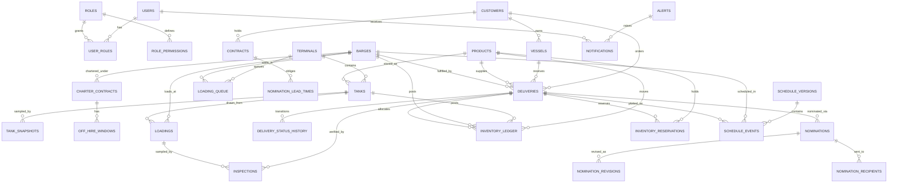

# Harbormaster — Data Model

Houston Harbor Bunker Fleet, Inventory & Commercial Operations Platform.
Companion to [`DATABASE_SCHEMA.sql`](./DATABASE_SCHEMA.sql) and the canonical
[`_DOMAIN_MODEL.md`](./_DOMAIN_MODEL.md). Operator: Fortune 100 energy major.
Terminal: **HOFTI**. Nomination counterparty: **Buffalo Marine**. Fleet: 8
time-chartered bunker barges (HH-201 … HH-208).

The database is organized into five PostgreSQL schemas:

| Schema | Purpose |
| --- | --- |
| `ident` | Users, RBAC roles/permissions, Entra ID object-id mapping |
| `ops` | Fleet, terminal, tanks, deliveries, loadings, scheduling, AIS, weather |
| `inv` | Products, enterprise inventory ledger, reservations, snapshots |
| `commercial` | Customers, vessels, contracts, charters, nominations |
| `audit` | Immutable audit log, alerts, AI recommendations, notifications |

---

## ER overview



---

## Enterprise inventory ledger model

Harbormaster does **not** store mutable inventory balances. Every physical and
commercial movement is written to `inv.inventory_ledger` as one or more signed
legs sharing an `event_id` (double-entry style: the legs of a business event net
to zero). All enterprise dimensions are **derived** by netting the ledger,
combined with active rows in `inv.inventory_reservations`. This gives a fully
auditable, point-in-time-reconstructable inventory position.

### Movement grammar

Each ledger leg carries a signed `qty_mt` (`+` into the referenced location, `-`
out of it) and exactly one physical location dimension (`tank_id` **xor**
`barge_id`), plus optional commercial slicing dimensions (`customer_id`,
`delivery_id`, `delivery_window`) and the flags `is_off_spec` / `is_committed`.

Representative events:

| Event | Legs |
| --- | --- |
| Replenishment into HOFTI | `+qty` on `tank_id` (`replenishment_in`) |
| Load barge from tank | `-qty` on `tank_id`, `+qty` on `barge_id` (`load_to_barge`) |
| Bunker a customer vessel | `-qty` on `barge_id`, `delivery_id` set, `is_committed=true` (`discharge_to_vessel`) |
| Blend | `blend_out` legs for components, `blend_in` leg for the blend |
| Off-spec flag | move quantity to `is_off_spec=true` via `off_spec_flag` |

### How each dimension is derived

Given a product (optionally sliced by barge / customer / terminal / delivery
window), over the ledger `L` and active reservations `R`:

| Dimension | Derivation |
| --- | --- |
| **Physical** | `SUM(L.qty_mt)` — total on-spec + off-spec mass under control |
| **HOFTI** | `SUM(L.qty_mt WHERE tank_id IS NOT NULL)` — terminal-held mass |
| **Floating** | `SUM(L.qty_mt WHERE barge_id IS NOT NULL)` — on-barge mass |
| **Off-spec** | `SUM(L.qty_mt WHERE is_off_spec)` |
| **Committed** | `SUM(L.qty_mt WHERE is_committed)` — allocated to a delivery |
| **Reserved** | `SUM(R.qty_mt WHERE status='active')` — soft holds |
| **Uncommitted** | `Physical − Committed − Reserved` |
| **Commercial Available** | `Physical − Committed − Reserved − Off-spec` |
| **Projected** | `Physical + Σ(incoming replenishment) − Σ(scheduled discharges)` over the forward horizon, from `schedule_events` + `tank_inventory_snapshots.incoming_replenish_mt` |

The view `inv.v_enterprise_inventory` implements the netting for the whole-fleet
position; `inv.v_barge_floating_inventory` slices Floating per barge. Projected
inventory is computed by the API forward-simulation service rather than a static
view because it depends on the current published schedule horizon.

**Off-hire correction:** when a barge enters an off-hire window
(`commercial.off_hire_windows`), its Floating heel remains in the ledger but is
excluded from Commercial Available by an `off_spec_flag`-equivalent reservation,
so idle heel is never sold.

---

## Table-by-table narrative (core tables)

**`ident.users`** — One row per Entra ID principal. `entra_object_id` (the OIDC
`oid` claim) is the durable external key; `upn` and `email` mirror the directory.
The API never trusts client-supplied identity — it maps the validated token `oid`
to this row and stamps `app.user_id` for the audit trigger.

**`ident.user_roles` / `ident.roles` / `ident.role_permissions`** — RBAC. Roles
are the eight workspace roles from the domain model, each mapped to an Entra app
role value. Permissions are `resource:action` pairs with an optional `constraint_jsonb`
for attribute-based scoping (e.g. a Blender limited to specific products). Roles
drive both application authorization and the row-level-security policies below.

**`inv.products`** — The five marine fuels (VLSFO, HSFO, ULSFO, LSMGO, MGO) with
sulphur %, ISO grade, and a reference density for liters@15C ↔ MT conversion used
during inspection reconciliation.

**`ops.terminals` / `ops.tanks`** — HOFTI and its tanks T-01…T-08, one product per
tank, with shell/working/minimum-operating capacities and nominal loading rate.
`tank_inventory_snapshots` is a read-model of gauged balances for the terminal
dashboard; the ledger remains the source of truth.

**`ops.barges`** — The 8 time-chartered bunker barges. Carries `hull_code`
(HH-201…), name, nominal capacity, heel, `mmsi` for AIS correlation, and the
current point on the operational lifecycle (`current_status`).

**`commercial.charter_contracts` / `commercial.off_hire_windows`** — Charter
economics (cost/day, heel allowance, hire dates) per barge, plus non-overlapping
off-hire windows enforced by a GiST exclusion constraint. Feeds
`commercial.v_charter_utilization`.

**`commercial.customers` / `commercial.vessels` / `commercial.contracts`** —
Customer accounts (Maersk, MSC, CMA CGM, Frontline, Teekay, ONE), their vessels,
and master supply contracts. `nomination_lead_times` encodes the contractual
6/12/24/48-hour nomination obligations per contract/product.

**`ops.deliveries`** — The central operational entity: a nominated bunker delivery
of one product to one vessel, assigned to a barge, with a `tstzrange` delivery
window and its position on the 16-state lifecycle. A partial index keeps only open
deliveries hot for the dispatch board.

**`ops.delivery_status_history`** — Immutable transition log (from/to status,
actor, timestamp, geo). This is the operational lifecycle audit trail;
`current_status` on the delivery is a denormalized convenience.

**`ops.loadings` / `ops.loading_queue`** — A loading fills a barge from a HOFTI
tank at Berth A/B; the queue tracks ordered waiting barges per berth, with a
partial unique index guaranteeing one barge per active berth position.

**`ops.inspections`** — Post-loading / post-delivery quality and quantity
verification. Beyond reconciliation figures (gross/net MT, liters@15C, density,
sulphur, water, on/off-spec), it stores **Azure AI Document Intelligence** output:
the source PDF URI, the extracted key/value + confidence map (`extracted_fields`
jsonb, GIN-indexed), the model version, and overall confidence. Off-spec results
are surfaced via a partial index.

**`commercial.nominations` / `nomination_revisions` / `nomination_recipients`** —
The Buffalo Marine nomination flow. `status` follows Draft Ready → Sent →
Acknowledged → Revision Required → Revised. Every revision is snapshotted
immutably in `nomination_revisions` (full document payload + reason), giving a
complete audit trail across the revision loop. Recipients track per-channel
delivery/acknowledgement.

**`inv.inventory_ledger`** — The double-entry movement ledger described above;
the analytical backbone of the platform. **`inv.inventory_reservations`** — soft
holds that reduce Commercial Available until consumed (at which point a committed
ledger leg is posted) or released/expired.

**`ops.schedule_versions` / `ops.schedule_events`** — The dispatch board. Editors
work a draft version; publishing snapshots the event set and marks it the single
current published version (enforced by a partial unique index). Events are
barge/delivery/loading time-windowed blocks.

**`audit.audit_log`** — Append-only, partitioned by month, populated by the
`audit.log_change()` trigger on high-value tables (deliveries, nominations,
ledger, user_roles) plus application security events. Records actor, action, and
old/new jsonb row images.

---

## Partitioning, retention & row-level security

### Partitioning

| Table | Strategy | Rationale |
| --- | --- | --- |
| `ops.ais_positions` | `RANGE (received_at)`, **monthly** | Very high ingest (per-vessel position stream). Old partitions dropped wholesale; recent partitions stay hot for the live map. |
| `audit.audit_log` | `RANGE (changed_at)`, **monthly** | Append-only, write-heavy, rarely re-queried beyond recent windows; monthly partitions make retention a `DROP TABLE`. |
| `inv.inventory_ledger` | `RANGE (effective_at)`, **quarterly** (recommended in prod) | Grows steadily; most reads target the current position/quarter. Balance rollups per closed quarter can be materialized so netting only scans open partitions. |

Partitions are provisioned ahead of time by a scheduled job (e.g. `pg_partman`
or an Azure Function). The schema ships explicit July/August 2026 partitions as
examples for `ais_positions` and `audit_log`.

### Retention

| Data | Retention | Disposition |
| --- | --- | --- |
| `ais_positions` | 90 days hot, 13 months in cold storage | Drop hot partitions after 90 days; archive to Parquet/Blob for analytics. |
| `audit_log` | 7 years (regulatory) | Keep online 18 months, archive older partitions to immutable Blob (WORM). |
| `tank_inventory_snapshots` | 400 days | Downsample to daily after 30 days. |
| `inventory_ledger` | Indefinite (financial record) | Never deleted; closed quarters archived + summarized. |
| `notifications` | 180 days | Purge read notifications after 180 days. |

### Row-level security (RLS)

RLS is enabled on tenant- and role-scoped tables. The API sets per-request GUCs
inside the transaction:

```sql
SET LOCAL app.user_id  = '<users.id>';
SET LOCAL app.user_upn = '<upn>';
SET LOCAL app.roles    = 'dispatcher,marine_scheduler';
```

Policies then enforce, for example:

- **Commercial isolation** — Traders and Commercial Operators see all products,
  but ABAC constraints in `role_permissions.constraint_jsonb` can restrict a
  Blender to specific products; policies read `app.roles` and the constraint set.
- **Delivery visibility** — Dispatchers and Marine Schedulers read/write all open
  deliveries; read-only roles (Executive Leadership) get `USING (true)` on SELECT
  and no write policy.
- **Audit immutability** — `audit.audit_log` grants `INSERT` only (no `UPDATE`/
  `DELETE`) to the application role; reads are restricted to Operations Manager,
  Commercial Manager, and Executive Leadership.
- **Actor stamping** — the `audit.log_change()` trigger reads `app.user_id` /
  `app.user_upn` from the GUCs so every shadowed change is attributable.

The application connects as a non-superuser role that is subject to these
policies; a separate migration/owner role bypasses RLS for DDL and backfills.
