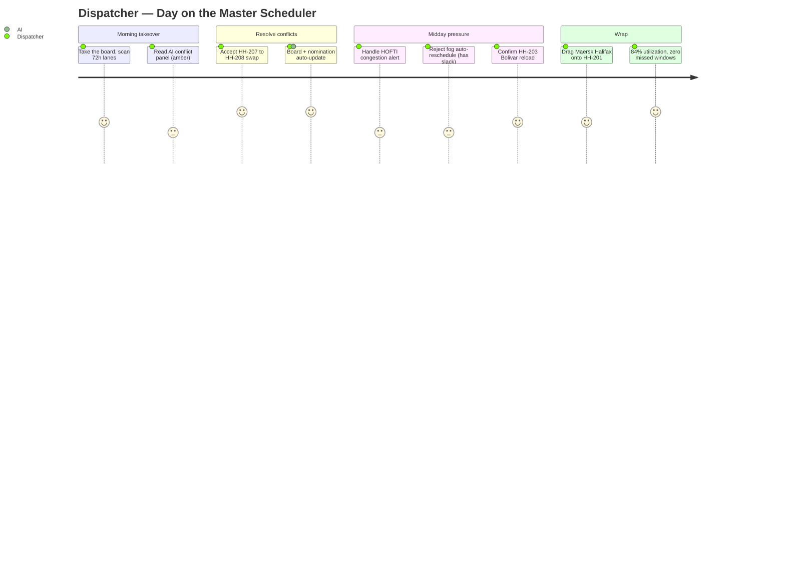
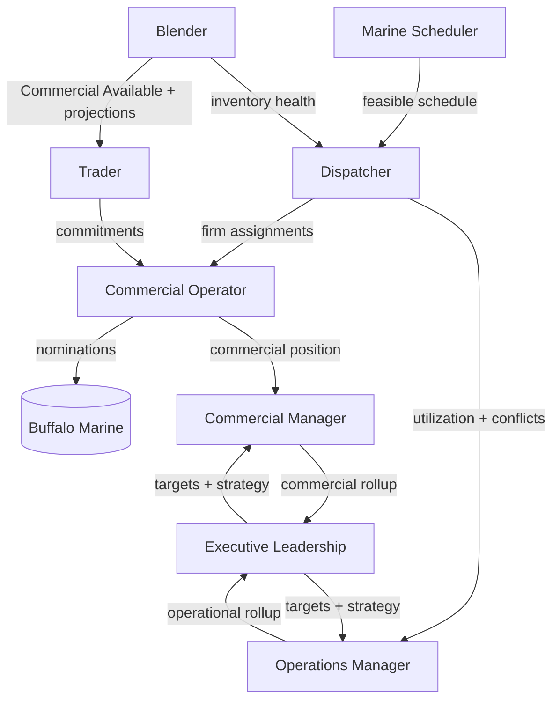

# Harbormaster — User Journeys (8 Roles)

> Houston Harbor Bunker Fleet, Inventory & Commercial Operations Platform
> Companion to [`_DOMAIN_MODEL.md`](./_DOMAIN_MODEL.md) and [`WORKFLOWS.md`](./WORKFLOWS.md).
> Fleet: HH-201 "San Jacinto", HH-202 "Buffalo Bayou", HH-203 "Bolivar", HH-204 "Morgan's Point", HH-205 "Texas City", HH-206 "Baytown", HH-207 "Galveston", HH-208 "Lynchburg".
> Products: VLSFO · HSFO · ULSFO · LSMGO · MGO. Reload: HOFTI. Nomination counterparty: Buffalo Marine.

Harbormaster serves eight distinct roles, each with its own workspace, decisions and KPIs, but all reading from one enterprise inventory ledger and one master schedule. The journeys below are concrete day-in-the-life scenarios using real barge names, customers, vessels and products from the domain model.

---

## 1. Commercial Operator

**Persona.** Maria Delgado, senior Commercial Operator on the 06:00–18:00 desk. She owns the physical-to-commercial handoff: turning inspected barge cargo into firm, error-free nominations to Buffalo Marine. Fast, precise, allergic to a rejected nomination.

**Primary goals.** Zero nomination errors; every delivery nominated inside its contract lead time; fast turnaround on Buffalo Marine revisions; clean audit trail.

**Workspace / modules.** Nomination Cockpit (draft queue, validation panel, one-click send), Buffalo Marine state tracker, delivery schedule (read), inspection status feed, audit history.

**End-to-end journey — the Buffalo Marine nomination workflow.**
1. 06:10 — Maria opens the **Nomination Cockpit**. Overnight, HH-205 "Texas City" completed a VLSFO load at HOFTI and its inspection PDF was auto-ingested; the barge is now `Inspection Complete`. A delivery of 850 MT VLSFO to "Maersk Sentosa" (24 h contract lead time) has crossed its threshold.
2. The platform has already **auto-generated a Draft Ready nomination**. Maria opens it and reviews the validation panel — all nine checks green: barge assigned, vessel matched, window in-contract, product VLSFO valid, qty ≤ on-barge Uncommitted, loading location confirmed, `Inspection Complete`, docs (BDN/COQ/MSDS) present, distribution list resolved.
3. 06:14 — She **one-click sends** it to Buffalo Marine. State ➜ `Sent`; the ack timer starts.
4. 07:02 — Buffalo Marine returns `Revision Required`: the delivery window shifted 3 hours. The cockpit surfaces the exact delta.
5. Maria accepts the auto-fill correction and **re-issues as Revised** (version 2, state ➜ `Sent`). At 07:20 it comes back `Acknowledged` — the "Maersk Sentosa" delivery is firm.
6. 09:30 — The AI dispatch optimizer swaps a later "MSC Diana" delivery from HH-203 "Bolivar" to HH-204 "Morgan's Point". Harbormaster **auto-revises** the affected nomination; Maria reviews the regenerated draft and re-sends.
7. 15:45 — An ack timer on a "CMA CGM Jacques Saade" LSMGO nomination lapses. The platform auto-reminds and flags escalation; Maria calls the Buffalo Marine desk and clears it before handing to Commercial Manager.
8. 17:55 — End of shift: every delivery in her window is `Acknowledged`, and the audit history shows every version, actor and timestamp.

**Key decisions.** Send vs hold a flagged draft; accept auto-fill vs manual edit on a revision; when to escalate a stale acknowledgement.

**KPIs.** Nomination error rate (rejected/total), % nominated within lead time, avg draft-to-acknowledged cycle time, revision count per nomination, ack-timer breaches.

---

## 2. Dispatcher

**Persona.** Deshawn Price, lead Dispatcher on the 24/7 rota. He owns the master schedule — which barge serves which vessel, in what order, reloading when. He lives on the board and trusts the AI to warn him before a conflict becomes a missed window.

**Primary goals.** No missed delivery windows; no reload starvation; high fleet utilization; conflicts resolved before they escalate.

**Workspace / modules.** Drag-and-drop Master Scheduler (barge lanes × time), AI conflict-detection panel, HOFTI queue view, AIS/Azure Maps fleet map, utilization dashboard.

**End-to-end journey — drag-and-drop scheduler + conflict detection.**
1. 07:00 — Deshawn takes the board. Eight barge lanes span the next 72 h. HH-206 "Baytown" (8,000 MT HSFO) is `Bunkering` "Front Altair"; HH-201 "San Jacinto" is `Transit to HOFTI` for a VLSFO reload.
2. The **AI conflict-detection panel** flags an amber: HH-207 "Galveston" (3,000 MT) is committed to two LSMGO deliveries — "Teekay Foundation" and "ONE Innovation" — with overlapping windows. Recommendation: move "ONE Innovation" to HH-208 "Lynchburg", with the plain-language rationale (protects both windows, +2,100 MT delivered, HH-207 idle −0 h).
3. 07:12 — Deshawn **accepts** the recommendation; the board updates instantly and the change propagates to the Buffalo Marine nomination and HOFTI queue.
4. 08:30 — A **congestion alert** fires: HOFTI queue depth exceeds threshold, Berth A and B both busy. He drags HH-202 "Buffalo Bayou"'s reload one slot later to relieve the queue.
5. 10:15 — NOAA marine advisory: fog in the Houston Ship Channel. The optimizer predicts a delay to HH-205 "Texas City"'s `Transit to Customer` leg toward "MSC Ambra". Deshawn **rejects** the auto-reschedule (the window has slack), logging the reason for the model.
6. 13:40 — HH-203 "Bolivar" returns to `Queue for Reload` low on VLSFO; he confirms the reload plan, keeping it off charter-idle.
7. 16:00 — He drags a newly firm "Maersk Halifax" VLSFO delivery onto HH-201 "San Jacinto"'s lane; conflict panel stays green.
8. 18:45 — Utilization dashboard reads 84% fleet-wide; zero missed windows on shift.

**Key decisions.** Accept vs reject each AI recommendation; which barge absorbs a swap; reload timing vs charter-idle; how to relieve berth congestion.

**KPIs.** On-time delivery window %, fleet utilization %, idle hours, reload starvation incidents, avg conflict-resolution time, AI recommendation accept rate.

---

## 3. Marine Scheduler

**Persona.** Priya Nair, Marine Scheduler bridging commercial intent and physical vessel movement. She owns barge assignment feasibility, berth/anchorage logistics, off-hire and charter constraints, and inspection exceptions.

**Primary goals.** Physically feasible schedules; charter and off-hire compliance; clean inspection handoffs; accurate ETAs.

**Workspace / modules.** Voyage planner, barge charter/off-hire calendar, HOFTI berth board, inspection exception queue, AIS tracking, Azure Maps.

**End-to-end journey.**
1. 05:30 — Priya reviews the overnight voyage plan. HH-208 "Lynchburg" enters an off-hire window at 14:00; she confirms no committed cargo conflicts and re-times its "ONE Innovation" LSMGO leg onto HH-207 "Galveston".
2. 08:00 — An **inspection exception** lands: HH-205 "Texas City"'s extracted VLSFO quantity is 40 MT under the `Load Complete` figure. She investigates with HOFTI, confirms a metering correction, and clears it so the barge advances to `Inspection Complete`.
3. 09:45 — She assigns berth/anchorage for "MSC Diana"'s delivery, checking channel transit time and tide against the contract window.
4. 11:20 — Charter-cost review: HH-206 "Baytown" idle hours creeping up; she coordinates with the Dispatcher to slot a "Front Altair" HSFO top-up.
5. 14:30 — She validates ETAs across the fleet against AIS, correcting HH-202 "Buffalo Bayou"'s projected `Waiting Alongside` time for "Maersk Sentosa".
6. 16:00 — Confirms the next-day HOFTI berth sequence with the terminal.

**Key decisions.** Which barge for a leg given off-hire/charter; berth vs anchorage; how to resolve an inspection discrepancy; ETA corrections.

**KPIs.** Schedule feasibility rate, off-hire/charter compliance, inspection exception resolution time, ETA accuracy, berth turnaround.

---

## 4. Blender

**Persona.** Sam Okafor, Blender and inventory-quality owner. He keeps every product in spec and every tank/barge position accurate, working from a continuous enterprise inventory view and forward projections.

**Primary goals.** Zero off-spec deliveries; accurate real-time inventory across all dimensions; reliable 24/48/72 h projections; enough VLSFO/HSFO/ULSFO/LSMGO/MGO in the right place at the right time.

**Workspace / modules.** **Enterprise Inventory Cockpit** (continuous ledger view + 24/48/72 h projections), tank/barge blend planner, quality/off-spec panel, HOFTI tank board.

**End-to-end journey — continuous enterprise inventory + 24/48/72h projections.**
1. 06:00 — Sam opens the **Enterprise Inventory Cockpit**. One live view spans every ledger dimension — Physical, Floating (on-barge), HOFTI, Reserved, Committed, Uncommitted, Commercial Available, Off-spec, Projected — sliced by Product / Barge / Customer / Terminal / Delivery Window.
2. He reads the **24 h projection**: VLSFO Commercial Available drops toward the minimum as three deliveries ("Maersk Sentosa", "Maersk Halifax", "MSC Ambra") draw down HH-201 and HH-205. Comfortable.
3. The **48 h projection** shows LSMGO tightening — "Teekay Foundation" and "ONE Innovation" both pull from HH-207/HH-208. Sam flags it and coordinates a HOFTI reload sequence so LSMGO stays above minimum operating level.
4. The **72 h projection** shows HSFO surplus on HH-206 "Baytown" and thin VLSFO; he plans a blend/reallocation so Commercial Available matches the forward commitment curve.
5. 09:15 — Quality panel: a HOFTI tank shows a density edge-case on a VLSFO parcel. Sam quarantines it to **Off-spec**, preventing it from being nominated, until a re-test clears it.
6. 11:00 — After HH-203 "Bolivar"'s inspection posts, the ledger recalcs; Sam confirms Floating and Projected reconcile to the liters@15C figures.
7. 14:00 — He rebalances Reserved vs Uncommitted so the Trader has clean Commercial Available to sell against.
8. 17:30 — End of day: all products projected above minimum through 72 h; zero off-spec exposure.

**Key decisions.** Blend/reallocation to match forward curve; quarantine vs release on quality edge-cases; reload sequencing to protect projections; Reserved vs Uncommitted split.

**KPIs.** Off-spec incidents, projection accuracy (24/48/72 h vs actual), Commercial Available vs commitment coverage, inventory reconciliation variance, minimum-operating-level breaches.

---

## 5. Trader

**Persona.** Elena Vasquez, Trader monetizing the uncommitted position. She sells physical bunkers against Commercial Available inventory, manages spread and exposure, and depends on the Blender's projections and the enterprise ledger.

**Primary goals.** Maximize margin on Uncommitted volume; avoid over-commitment; source product ahead of low-inventory alerts; accurate exposure.

**Workspace / modules.** Commercial position board (Committed/Uncommitted/Commercial Available), pricing & spread panel, low-inventory alert feed, customer commitment book.

**End-to-end journey.**
1. 06:30 — Elena checks the **commercial position board**: 4,200 MT VLSFO and 2,800 MT LSMGO Commercial Available across the fleet for the next 48 h.
2. 07:15 — A **low-inventory alert** fires from the HOFTI workflow: LSMGO projected below minimum in 40 h. She holds back further LSMGO offers and coordinates re-sourcing with the Trader desk before overselling.
3. 09:00 — She prices and closes an 1,100 MT VLSFO deal to Maersk for "Maersk Halifax", moving volume Uncommitted ➜ Committed; the ledger and schedule update live.
4. 11:30 — Reviews spread on HSFO with a "Front Altair" top-up opportunity on HH-206 "Baytown"; margin acceptable, she commits.
5. 13:45 — Exposure check: she confirms no product is over-committed against the Blender's 72 h projection.
6. 16:00 — Books an ULSFO parcel for a spot inquiry, verifying Commercial Available before confirming.

**Key decisions.** Sell vs hold Uncommitted volume; price/spread acceptance; when a low-inventory alert caps further selling; product sourcing.

**KPIs.** Margin per MT, Uncommitted-to-Committed conversion, over-commitment incidents, realized vs projected spread, deals closed within available inventory.

---

## 6. Commercial Manager

**Persona.** Tom Reilly, Commercial Manager owning the desk's commercial performance and the Buffalo Marine relationship. He handles escalations, approves exceptions, and keeps commercial and operations aligned.

**Primary goals.** Commercial targets met; nomination SLA with Buffalo Marine held; exceptions resolved fast; customer satisfaction.

**Workspace / modules.** Commercial performance dashboard, nomination escalation queue, customer/contract book, exception approvals, audit review.

**End-to-end journey.**
1. 07:00 — Tom reviews the **commercial performance dashboard**: nominations acknowledged, revision rates, margin, and any SLA risk with Buffalo Marine.
2. 08:30 — An escalated **stale acknowledgement** on a "CMA CGM Jacques Saade" LSMGO nomination reaches him; he calls the Buffalo Marine account lead and clears it.
3. 10:00 — Approves a commercial exception: a rush 24 h nomination for "MSC Ambra" that needs a manual quantity override, which he authorizes with an audit note.
4. 12:00 — Aligns with the Trader and Blender on the LSMGO tightness flagged in the 48 h projection, agreeing to prioritize LSMGO reloads commercially.
5. 14:30 — Reviews revision-count trend; HH-203/HH-204 barge swaps are driving auto-revisions, and he confirms the process is holding SLA.
6. 16:30 — Signs off the day's commercial numbers for the Operations Manager and Executive rollup.

**Key decisions.** Approve/deny commercial exceptions; escalation handling with Buffalo Marine; commercial prioritization of reloads; SLA trade-offs.

**KPIs.** Nomination SLA adherence, revision rate, margin vs target, escalation resolution time, customer satisfaction, exception approval turnaround.

---

## 7. Operations Manager

**Persona.** Grace Lin, Operations Manager accountable for safe, efficient 24/7/365 fleet and terminal operations. She owns fleet utilization, HOFTI reliability, alert response, and cross-shift continuity.

**Primary goals.** Safe operations; high utilization at controlled charter cost; no HOFTI stockout or gridlock; fast alert response.

**Workspace / modules.** Operations control tower (fleet + HOFTI overview), alert console (low-inventory / congestion / inspection exceptions), utilization & charter-cost dashboard, incident/audit review.

**End-to-end journey.**
1. 06:00 — Grace opens the **control tower**: all eight barges' statuses, HOFTI tank levels, and both berths at a glance. HH-206 "Baytown" `Bunkering`; HOFTI T-03 VLSFO at 62% working.
2. 07:30 — A **congestion alert** and a **low-inventory alert** land together. She coordinates the Dispatcher (re-time reloads) and Trader (cap LSMGO selling) to resolve both without a missed window.
3. 09:00 — Reviews charter-cost dashboard: HH-207 "Galveston" idle hours trending up; she directs the Marine Scheduler to raise its utilization.
4. 11:00 — An inspection exception on HH-205 "Texas City" is cleared by the Marine Scheduler; Grace confirms no downstream impact.
5. 13:00 — Weather: a NOAA advisory prompts a review of channel transits; she confirms the optimizer's contingency and briefs the next shift.
6. 15:30 — Runs the utilization vs charter-cost review and updates the Executive rollup inputs.
7. 18:00 — Clean shift handover with all alerts closed.

**Key decisions.** Alert prioritization and cross-role coordination; utilization vs charter-cost trade-offs; weather contingency approval; shift-handover risk calls.

**KPIs.** Fleet utilization %, charter cost per MT delivered, alert response/close time, HOFTI stockout/gridlock incidents, safety incidents, on-time delivery %.

---

## 8. Executive Leadership

**Persona.** Robert Ames, VP overseeing the Houston Harbor bunker business. He consumes the strategic picture — margin, volume, utilization, reliability — through Power BI, and steers on trends, not tickets.

**Primary goals.** Profitable, reliable, growing bunker operation; capital and charter efficiency; strategic customer growth; risk visibility.

**Workspace / modules.** **Power BI executive dashboard** (semantic model / DirectQuery) — margin, delivered volume, utilization, nomination reliability, inventory health, customer mix.

**End-to-end journey.**
1. 07:00 — Robert opens the **Power BI executive dashboard**, refreshed overnight from the enterprise ledger and schedule.
2. He reads **delivered volume** by product (VLSFO leading, LSMGO growing) and margin per MT trending vs target.
3. **Fleet utilization** at 84% with charter cost per MT down quarter-on-quarter; he notes HH-207/HH-208 (3,000 MT) as the utilization swing.
4. **Nomination reliability** with Buffalo Marine holding SLA; revision rate stable despite barge swaps.
5. **Inventory health**: no minimum-operating-level breaches in the trailing week; 72 h projections green.
6. **Customer mix**: Maersk and MSC concentration; he flags CMA CGM and ONE growth for the commercial team.
7. 07:30 — He sets a strategic ask with the Commercial and Operations Managers on lifting small-barge utilization, then steps back to let the desk operate.

**Key decisions.** Capital/charter strategy; customer growth priorities; target-setting; risk tolerance and investment.

**KPIs.** EBITDA / margin per MT, total delivered volume, fleet utilization %, charter cost per MT, nomination reliability/SLA, inventory availability, customer concentration and growth.

---

## Role interaction map

The eight roles form one operating chain from physical cargo to executive strategy. Inspection and inventory feed the Blender and Trader; the Dispatcher and Marine Scheduler shape the physical schedule; the Commercial Operator nominates to Buffalo Marine; managers steer; leadership reads the outcome in Power BI.

**Narrative.** The Marine Scheduler hands feasible voyages to the Dispatcher, who firms barge assignments the Commercial Operator turns into Buffalo Marine nominations. In parallel, the Blender maintains the enterprise inventory and forward projections that give the Trader clean Commercial Available to sell, whose commitments flow back into the Commercial Operator's nominations. The Commercial and Operations Managers roll commercial and operational performance up to Executive Leadership, who sets targets and strategy back down the chain. One ledger, one schedule, eight roles — the full Houston Harbor bunker operation.
