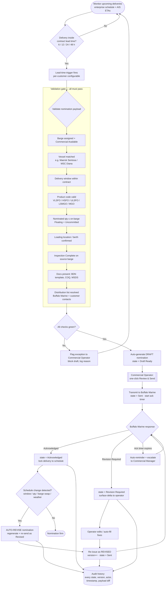
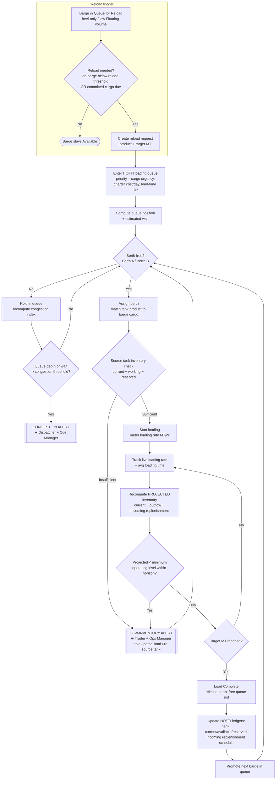
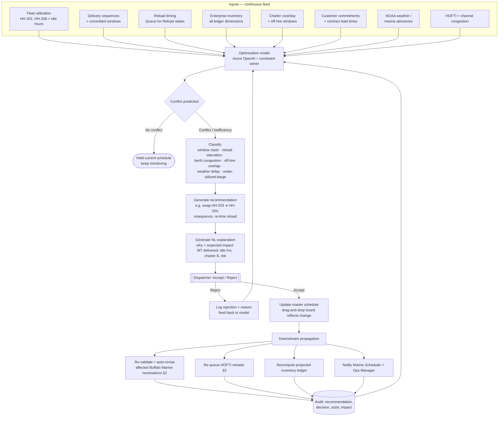
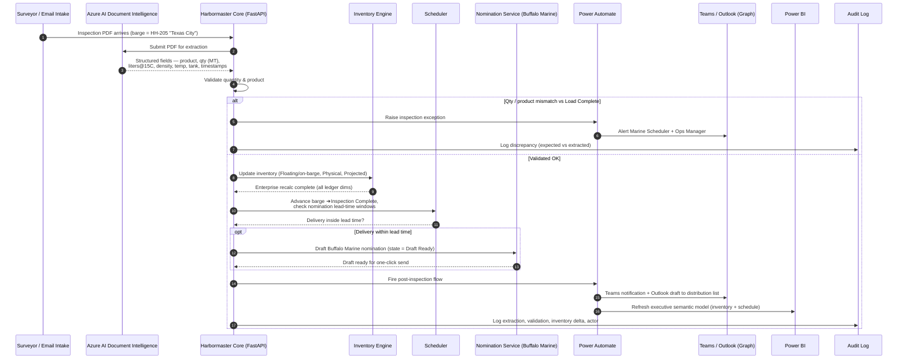
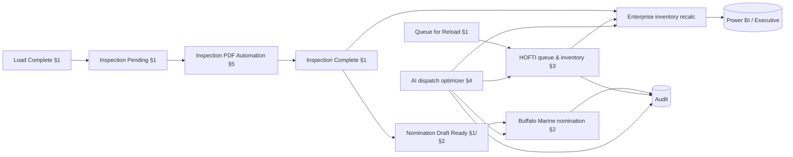

# Harbormaster — Operational Workflows & Automation

> Houston Harbor Bunker Fleet, Inventory & Commercial Operations Platform
> Operator: Fortune 100 energy major · Nomination counterparty: **Buffalo Marine** · Reload terminal: **HOFTI**
> Companion to [`_DOMAIN_MODEL.md`](./_DOMAIN_MODEL.md). All barge IDs, product codes, statuses, nomination states and roles referenced here are canonical.

This document describes the automated workflows that drive Harbormaster. Each barge (HH-201 "San Jacinto" through HH-208 "Lynchburg") moves through the ordered operational status lifecycle 24/7/365, and every transition fires one or more automatic triggers — inventory recalculations, nomination drafting, inspection ingestion, notifications and audit writes. The five workflows below are the load-bearing automations.

---

## 1. Barge Operational Lifecycle

Every bunker barge follows a single ordered status lifecycle from `Available` to `Available Again`, then loops. Each transition below carries the **automatic workflow/trigger** the platform fires when the barge crosses it — no operator action is required to fire these; operators intervene only to confirm, override, or resolve exceptions. State is advanced by AIS position events, HOFTI terminal telemetry, inspection PDF ingestion, and bunkering completion signals, all published on the Azure Service Bus event bus and cached/broadcast via Redis pub/sub.

```mermaid
stateDiagram-v2
    direction TB
    [*] --> Available

    Available --> TransitToHOFTI : dispatch assigns reload<br/>➜ reserve HOFTI tank + berth slot,<br/>emit ETA to scheduler
    TransitToHOFTI --> WaitingToLoad : AIS geofence @ HOFTI<br/>➜ join HOFTI loading queue,<br/>compute queue position + congestion
    WaitingToLoad --> Loading : berth assigned (Berth A/B)<br/>➜ start loading-rate meter (MT/hr),<br/>decrement HOFTI available inventory in real time
    Loading --> LoadComplete : nominated volume reached / stop order<br/>➜ freeze on-barge (Floating) volume,<br/>lock loading meter, release berth
    LoadComplete --> InspectionPending : auto on Load Complete<br/>➜ AUTO-CREATE Inspection Pending record,<br/>arm Azure AI Document Intelligence intake
    InspectionPending --> InspectionComplete : inspection PDF ingested + validated<br/>➜ RECALC enterprise inventory,<br/>CHECK nomination lead-time windows
    InspectionComplete --> NominationDraftReady : nomination lead-time trigger fires<br/>➜ AUTO-GENERATE Buffalo Marine draft<br/>(barge, vessel, product, qty, window)
    NominationDraftReady --> NominationSent : operator one-click review & send<br/>➜ transmit to Buffalo Marine,<br/>state = Sent, start ack timer + audit
    NominationSent --> TransitToCustomer : nomination Acknowledged / departure<br/>➜ publish voyage to Azure Maps,<br/>notify customer vessel + berth/anchorage
    TransitToCustomer --> WaitingAlongside : AIS geofence @ delivery point<br/>➜ open delivery window watch,<br/>alert if outside contract window
    WaitingAlongside --> Bunkering : made fast alongside vessel<br/>➜ start delivery meter,<br/>move volume Committed ➜ delivered
    Bunkering --> DeliveryComplete : pumping stopped / BDN signed<br/>➜ finalize delivered MT,<br/>generate Bunker Delivery Note + invoice trigger
    DeliveryComplete --> ReturnTransit : cast off from vessel<br/>➜ decrement Committed inventory,<br/>update barge utilization + idle counters
    ReturnTransit --> QueueForReload : heel-only / low on-barge volume<br/>➜ evaluate reload need vs HOFTI inventory,<br/>enqueue AI dispatch reload candidate
    QueueForReload --> AvailableAgain : reload plan confirmed / no cargo due<br/>➜ mark barge Commercial Available,<br/>recompute fleet utilization
    AvailableAgain --> Available : cycle reset<br/>➜ barge re-enters dispatchable pool

    note right of InspectionComplete
        Recalc touches every ledger dimension:
        Physical, Floating, HOFTI, Reserved,
        Committed, Uncommitted, Commercial
        Available, Off-spec, Projected.
    end note
    note right of NominationDraftReady
        Draft feeds the Buffalo Marine
        nomination sub-workflow (§2).
    end note
```

**Narrative.** A barge such as HH-205 "Texas City" (8,000 MT) begins `Available` in the dispatchable pool. When the Dispatcher assigns a reload, it moves to `Transit to HOFTI`, reserving a HOFTI tank and berth slot. On AIS geofence arrival it becomes `Waiting to Load` and joins the HOFTI queue; berth assignment starts `Loading`, where the loading-rate meter draws down HOFTI available inventory live. At `Load Complete` the platform freezes the on-barge (Floating) volume and — the key automation — **auto-creates the `Inspection Pending` record** and arms Azure AI Document Intelligence. When the inspection PDF is ingested and validated the barge reaches `Inspection Complete`, which **recalculates enterprise inventory and checks nomination lead-time windows**. If a customer delivery is inside its configured lead time, the system fires `Nomination Draft Ready` by **auto-generating a Buffalo Marine draft**; the Commercial Operator's one-click send advances it to `Nomination Sent`. From there the barge sails (`Transit to Customer`), holds (`Waiting Alongside`), delivers (`Bunkering` ➜ `Delivery Complete`, generating the Bunker Delivery Note), returns (`Return Transit`), is evaluated for reload (`Queue for Reload`), and finally returns to `Available Again` before resetting to `Available`. The loop is continuous and event-driven; operators supervise exceptions rather than clicking each step.

---

## 2. Delivery Nomination Workflow (Buffalo Marine)

Nominations are the commercial contract between the operator and Buffalo Marine for each physical delivery. Harbormaster monitors every upcoming delivery, fires a configurable lead-time trigger (6 / 12 / 24 / 48 h per the customer contract), validates the full nomination payload, auto-generates a draft, and gives the Commercial Operator a one-click review-and-send. It then tracks the nomination state machine (`Draft Ready → Sent → Acknowledged → Revision Required` loop, plus `Revised` re-issue) and auto-revises on any schedule change, keeping a complete audit trail.

**Narrative.** The workflow continuously watches the enterprise schedule and AIS ETAs. When a delivery — say 850 MT VLSFO to "Maersk Sentosa" on a 24 h contract — crosses its lead-time threshold, the trigger fires and the validation gate runs nine checks in sequence: barge availability, vessel match, window compliance, product-code validity, quantity against on-barge Uncommitted volume, loading location, source-barge `Inspection Complete`, required documents, and distribution list. Any failure flags an exception back to the Commercial Operator and blocks the draft. When all pass, Harbormaster auto-generates the `Draft Ready` nomination; the operator reviews and sends with one click, moving it to `Sent`. Buffalo Marine either `Acknowledged`s it (firming the delivery) or returns `Revision Required`, which loops through an operator edit and a versioned `Revised` re-issue. If the ack timer lapses, the platform auto-reminds and escalates to the Commercial Manager. Crucially, any downstream schedule change — a shifted window, a barge swap from HH-203 "Bolivar" to HH-204 "Morgan's Point", or a weather delay — triggers an **automatic revision** that regenerates and re-sends the nomination. Every state change, version, actor and payload diff is written to an immutable audit history.

---

## 3. HOFTI Loading Queue & Inventory Workflow

HOFTI is the primary bunker reload terminal, with tanks T-01..T-08 (one product each) and two loading berths (Berth A / Berth B). This workflow manages the reload trigger, the loading queue, berth assignment, live loading rate, projected inventory, and the low-inventory / congestion alerting that protects the whole fleet's ability to keep bunkering.

**Narrative.** When a barge lands in `Queue for Reload`, the terminal workflow decides whether a reload is genuinely needed — either on-barge volume is below the reload threshold or committed cargo is due. A reload request enters the HOFTI queue, prioritized by cargo urgency, charter cost/day (a 3,000 MT HH-207 "Galveston" idling burns charter differently than an 8,000 MT HH-206 "Baytown"), and lead-time risk. The workflow computes queue position and estimated wait, then assigns Berth A or Berth B, matching the tank's product to the barge's intended cargo. Before pumping, it verifies source-tank inventory (`current − working − reserved`); if short, it fires a **low-inventory alert** to the Trader and Operations Manager and offers hold / partial-load / re-source options. During loading it meters the live rate (MT/hr) and continuously recomputes **projected inventory** against incoming replenishment; if the projection dips below the minimum operating level within the planning horizon, the same low-inventory alert fires early. Queue depth or wait beyond threshold raises a **congestion alert** to the Dispatcher and Ops Manager. On completion the terminal ledgers update and the next queued barge is promoted.

---

## 4. AI Dispatch Optimization Loop

The AI dispatch optimizer (Azure OpenAI) runs continuously in the background, ingesting the full operational picture, predicting conflicts before they materialize, and proposing schedule changes with plain-language explanations. It is advisory: the Dispatcher accepts or rejects every recommendation, and accepted changes propagate downstream to nominations, HOFTI queueing and inventory.

**Narrative.** The optimizer fuses eight live input streams — fleet utilization and idle hours, delivery sequences and committed windows, reload timing, the full enterprise inventory, charter cost/day and off-hire windows, customer commitments and lead times, NOAA weather advisories, and HOFTI/channel congestion. A constraint-aware model predicts conflicts before they bite: a window clash, reload starvation, berth congestion, an off-hire overlap, a weather delay, or an under-utilized barge. For each, it generates a concrete recommendation — for example, swapping a delivery from HH-203 "Bolivar" to HH-204 "Morgan's Point" to protect a "MSC Diana" window — paired with a **natural-language explanation** stating why and the expected impact in MT delivered, idle hours, charter dollars and risk. The Dispatcher accepts or rejects; rejections (with reasons) feed back to sharpen the model. Accepted changes update the master drag-and-drop schedule and **propagate downstream**: affected Buffalo Marine nominations are auto-revised (§2), HOFTI reloads are re-queued (§3), projected inventory is recomputed, and the Marine Scheduler and Ops Manager are notified. Every recommendation and decision is audited and looped back into the model.

---

## 5. Inspection PDF Automation

Independent surveyor inspection reports arrive as PDFs after each HOFTI load. This sequence turns a raw PDF into validated inventory, a schedule update, a drafted nomination, and stakeholder notifications — with no manual keying — using Azure AI Document Intelligence for OCR/extraction and Power Automate for the notification and analytics fan-out.

**Narrative.** When an inspection PDF for HH-205 "Texas City" hits the email intake, Harbormaster submits it to Azure AI Document Intelligence, which returns structured fields: product code, quantity in MT, density/temperature-corrected liters@15C, tank, and timestamps. The core service **validates extracted quantity and product against the `Load Complete` figures**. On a mismatch it raises an exception via Power Automate, alerting the Marine Scheduler and Operations Manager and logging the discrepancy. On success it updates the inventory engine (Floating/on-barge, Physical and Projected across every ledger dimension), advances the barge to `Inspection Complete`, and rechecks nomination lead-time windows. If a delivery is inside its window, it **drafts the Buffalo Marine nomination** ready for the Commercial Operator's one-click send. Power Automate then fans out — a Teams notification and an Outlook draft to the distribution list, and a Power BI semantic-model refresh — and the full extraction, validation and inventory delta are written to the audit log. What was a manual survey-to-spreadsheet chore becomes a hands-off pipeline from PDF to firm commercial position.

---

## Cross-workflow event map

The five workflows are not islands; they are stitched together by the barge lifecycle and the event bus. The map below shows how a single load event ripples across the platform.

**Narrative.** A `Load Complete` on any barge auto-creates `Inspection Pending`, which the PDF automation (§5) resolves into `Inspection Complete`. That single transition recalculates enterprise inventory and, when a delivery is in range, spins up the Buffalo Marine nomination workflow (§2). Meanwhile barges cycling through `Queue for Reload` drive the HOFTI terminal workflow (§3), which also feeds the inventory recalc. Above all of it, the AI dispatch optimizer (§4) continuously reshapes the schedule and pushes changes back into nominations, HOFTI queueing and inventory. Every material event lands in the audit log and refreshes the Power BI executive model — one coherent, event-driven operating system for the Houston Harbor bunker fleet.
